Figure1
================
2023-06-09

``` r
# load libraries
library(ggplot2)
library(hexbin)
library(reshape2)
library(viridis)
```

    ## Loading required package: viridisLite

``` r
library(dplyr)
```

    ## 
    ## Attaching package: 'dplyr'

    ## The following objects are masked from 'package:stats':
    ## 
    ##     filter, lag

    ## The following objects are masked from 'package:base':
    ## 
    ##     intersect, setdiff, setequal, union

``` r
library(mgcv)
```

    ## Loading required package: nlme

    ## 
    ## Attaching package: 'nlme'

    ## The following object is masked from 'package:dplyr':
    ## 
    ##     collapse

    ## This is mgcv 1.8-42. For overview type 'help("mgcv-package")'.

``` r
library(tidyr)
```

    ## 
    ## Attaching package: 'tidyr'

    ## The following object is masked from 'package:reshape2':
    ## 
    ##     smiths

``` r
library(knitr)
knitr::opts_chunk$set(fig.width=12, fig.height=12) 
```

``` r
plot_bootstraps <- function(data,maxval,Name,maxValuePlot,BorderlineClinical,Clinical) {
  # Melt the data frame
  data_melt <- melt(t(data))
  data_melt$Var1 <- rep(seq(0, maxval), nrow(data))

  # Calculate percentiles
  percentiles <- data %>%
    summarise(across(everything(), quantile, probs = c(0.01, 0.99), na.rm = TRUE))
  
  percentiles_long <- tidyr::pivot_longer(percentiles, cols = everything(), names_to = "Percentile", values_to = "YValue")

  # Add CI column
  data_melt$CI <- 0
  
  # Prepare CIs for insertion
  CIs <- data.frame(rep(seq(0, maxval), 2), c(rep(10001, maxval+1), rep(10002, maxval+1)), percentiles_long$YValue, rep(1, ((maxval+1)*2)))
  colnames(CIs) <- colnames(data_melt)
  
  # Add CIs
  data_melt2 <- rbind(data_melt, CIs)
  
  # Convert CI column to factor
  data_melt2$CI <- as.factor(data_melt2$CI)
  
  # Plotting the lines
  ggplot(data = data_melt2, aes(x = Var1, y = value, group = Var2, color = Var2)) +
    geom_line(aes(alpha = CI), show.legend = FALSE) +
    scale_color_viridis_c(option = "inferno", direction = -1) +
    scale_alpha_manual(values = c(0.01, 1), guide = FALSE) + ylim(c(-1.5,1.5)) +
    theme_minimal(base_size=34) + 
    ylab(expression(italic(g)))+xlab(Name)+
    geom_vline(xintercept = BorderlineClinical, linetype = "dashed")+
    geom_vline(xintercept = Clinical, linetype = "dashed")+
    theme(panel.border = element_rect(color = "black", fill = NA, size = 1))+
    scale_x_continuous(limits = c(0,maxValuePlot),expand = expansion(mult = c(0, 0)))
}

# and and a derivatives version. only change is ylim
plot_bootstrapDerivs <- function(data,maxval,Name,maxValuePlot,BorderlineClinical,Clinical) {
  # Melt the data frame
  data_melt <- melt(t(data))
  data_melt$Var1 <- rep(seq(1, maxval), nrow(data))

  # Calculate percentiles
  percentiles <- data %>%
    summarise(across(everything(), quantile, probs = c(0.01, 0.99), na.rm = TRUE))
  
  percentiles_long <- tidyr::pivot_longer(percentiles, cols = everything(), names_to = "Percentile", values_to = "YValue")

  # Add CI column
  data_melt$CI <- 0
  
  # Prepare CIs for insertion
  CIs <- data.frame(rep(seq(0, maxval), 2), c(rep(10001, maxval+1), rep(10002, maxval+1)), percentiles_long$YValue, rep(1, ((maxval+1)*2)))
  colnames(CIs) <- colnames(data_melt)
  
  # Add CIs
  data_melt2 <- rbind(data_melt, CIs)
  
  # Convert CI column to factor
  data_melt2$CI <- as.factor(data_melt2$CI)
  
  # Plotting the lines
  ggplot(data = data_melt2, aes(x = Var1, y = value, group = Var2, color = Var2)) +
    geom_line(aes(alpha = CI), show.legend = FALSE) +
    scale_color_viridis_c(option = "inferno", direction = -1) +
    scale_alpha_manual(values = c(0.01, 1), guide = FALSE) + ylim(c(-.15,.15)) +
    theme_minimal(base_size=35) + 
    ylab(expression(italic(g)))+xlab(Name)+
    geom_vline(xintercept = BorderlineClinical, linetype = "dashed")+
    geom_vline(xintercept = Clinical, linetype = "dashed")+
    theme(panel.border = element_rect(color = "black", fill = NA, size = 1))+
    scale_x_continuous(limits = c(0,maxValuePlot),expand = expansion(mult = c(0, 0)))
}


find_furthest_nonzero <- function(data) {
  numZeros=colSums(data==0)
  isZeroZeros=numZeros==0
  furthest_nonzero=sum(isZeroZeros)
}

# set colors
my_palette <- colorRampPalette(colors = c("#051099", "#1d5cb7", "white", "#e41a1c", "#a80009"))
```

``` r
# load in masterdf (saved out from sample construction)
masterdf=readRDS('~/gp_masterdf.rds')
# convert all cbcl scores to numeric
masterdf$cbcl_scr_syn_totprob_r=as.numeric(masterdf$cbcl_scr_syn_totprob_r)
masterdf$cbcl_scr_syn_internal_r=as.numeric(masterdf$cbcl_scr_syn_internal_r)
masterdf$cbcl_scr_syn_external_r=as.numeric(masterdf$cbcl_scr_syn_external_r)
masterdf$cbcl_scr_syn_somatic_r=as.numeric(masterdf$cbcl_scr_syn_somatic_r)
masterdf$cbcl_scr_syn_anxdep_r=as.numeric(masterdf$cbcl_scr_syn_anxdep_r)
masterdf$cbcl_scr_syn_thought_r=as.numeric(masterdf$cbcl_scr_syn_thought_r)
masterdf$cbcl_scr_syn_withdep_r=as.numeric(masterdf$cbcl_scr_syn_withdep_r)
masterdf$cbcl_scr_syn_social_r=as.numeric(masterdf$cbcl_scr_syn_social_r)
masterdf$cbcl_scr_syn_attention_r=as.numeric(masterdf$cbcl_scr_syn_attention_r)
masterdf$cbcl_scr_syn_rulebreak_r=as.numeric(masterdf$cbcl_scr_syn_rulebreak_r)
masterdf$cbcl_scr_syn_aggressive_r=as.numeric(masterdf$cbcl_scr_syn_aggressive_r)
# AIC to confirm nonlinearities 
# p factor
pgAge<-bam(g~s(cbcl_scr_syn_totprob_r,k=4)+s(interview_age,k=4),data=masterdf)
pgAgeL<-bam(g~cbcl_scr_syn_totprob_r+s(interview_age,k=4),data=masterdf)
AIC(pgAge)
```

    ## [1] 25903.84

``` r
AIC(pgAgeL)
```

    ## [1] 25910.56

``` r
# confirm linear is higher AIC than nonlin
paste('p nonlin:',AIC(pgAge)<AIC(pgAgeL))
```

    ## [1] "p nonlin: TRUE"

``` r
# internalizing
intAge<-bam(g~s(cbcl_scr_syn_internal_r,k=4)+s(interview_age,k=4),data=masterdf)
intAgeL<-bam(g~cbcl_scr_syn_internal_r+s(interview_age,k=4),data=masterdf)
AIC(intAge)
```

    ## [1] 25909.84

``` r
AIC(intAgeL)
```

    ## [1] 25932.79

``` r
# confirm linear is higher AIC than nonlin
paste('int nonlin:',AIC(intAge)<AIC(intAgeL))
```

    ## [1] "int nonlin: TRUE"

``` r
# externalizing
extAge<-bam(g~s(cbcl_scr_syn_external_r,k=4)+s(interview_age,k=4),data=masterdf)
extAgeL<-bam(g~cbcl_scr_syn_external_r+s(interview_age,k=4),data=masterdf)
AIC(extAge)
```

    ## [1] 25885.39

``` r
AIC(extAgeL)
```

    ## [1] 25885.06

``` r
# confirm linear is higher AIC than nonlin
paste('ext nonlin:',AIC(extAge)<AIC(extAgeL))
```

    ## [1] "ext nonlin: FALSE"

``` r
# somatic
somAge<-bam(g~s(cbcl_scr_syn_somatic_r,k=4)+s(interview_age,k=4),data=masterdf)
somAgeL<-bam(g~cbcl_scr_syn_somatic_r+s(interview_age,k=4),data=masterdf)
AIC(somAge)
```

    ## [1] 25921.81

``` r
AIC(somAgeL)
```

    ## [1] 25927.58

``` r
# confirm linear is higher AIC than nonlin
paste('somatic nonlin:',AIC(somAge)<AIC(somAgeL))
```

    ## [1] "somatic nonlin: TRUE"

``` r
# attention
attAge<-bam(g~s(cbcl_scr_syn_attention_r,k=4)+s(interview_age,k=4),data=masterdf)
attAgeL<-bam(g~cbcl_scr_syn_attention_r+s(interview_age,k=4),data=masterdf)
AIC(attAge)
```

    ## [1] 25859.56

``` r
AIC(attAgeL)
```

    ## [1] 25859.56

``` r
# confirm linear is higher AIC than nonlin
paste('attn. nonlin:',AIC(attAge)<AIC(attAgeL))
```

    ## [1] "attn. nonlin: FALSE"

``` r
# thought
thoAge<-bam(g~s(cbcl_scr_syn_thought_r,k=4)+s(interview_age,k=4),data=masterdf)
thoAgeL<-bam(g~cbcl_scr_syn_thought_r+s(interview_age,k=4),data=masterdf)
AIC(thoAge)
```

    ## [1] 25904.51

``` r
AIC(thoAgeL)
```

    ## [1] 25932.26

``` r
# confirm linear is higher AIC than nonlin
paste('thought nonlin:',AIC(thoAge)<AIC(thoAgeL))
```

    ## [1] "thought nonlin: TRUE"

``` r
# social
socAge<-bam(g~s(cbcl_scr_syn_social_r,k=4)+s(interview_age,k=4),data=masterdf)
socAgeL<-bam(g~cbcl_scr_syn_social_r+s(interview_age,k=4),data=masterdf)
AIC(socAge)
```

    ## [1] 25836.57

``` r
AIC(socAgeL)
```

    ## [1] 25836.93

``` r
# confirm linear is higher AIC than nonlin
paste('social nonlin:',AIC(socAge)<AIC(socAgeL))
```

    ## [1] "social nonlin: TRUE"

``` r
# anxious depression
anxdepAge<-bam(g~s(cbcl_scr_syn_anxdep_r,k=4)+s(interview_age,k=4),data=masterdf)
anxdepAgeL<-bam(g~cbcl_scr_syn_anxdep_r+s(interview_age,k=4),data=masterdf)
AIC(anxdepAge)
```

    ## [1] 25891.82

``` r
AIC(anxdepAgeL)
```

    ## [1] 25913.74

``` r
# confirm linear is higher AIC than nonlin
paste('anx. dep. nonlin:',AIC(anxdepAge)<AIC(anxdepAgeL))
```

    ## [1] "anx. dep. nonlin: TRUE"

``` r
# withdrawn depression
withdepAge<-bam(g~s(cbcl_scr_syn_withdep_r,k=4)+s(interview_age,k=4),data=masterdf)
withdepAgeL<-bam(g~cbcl_scr_syn_withdep_r+s(interview_age,k=4),data=masterdf)
AIC(withdepAge)
```

    ## [1] 25927.92

``` r
AIC(withdepAgeL)
```

    ## [1] 25935.53

``` r
# confirm linear is higher AIC than nonlin
paste('with. dep. nonlin:',AIC(withdepAge)<AIC(withdepAgeL))
```

    ## [1] "with. dep. nonlin: TRUE"

``` r
# rule breaking
ruleAge<-bam(g~s(cbcl_scr_syn_rulebreak_r,k=4)+s(interview_age,k=4),data=masterdf)
ruleAgeL<-bam(g~cbcl_scr_syn_rulebreak_r+s(interview_age,k=4),data=masterdf)
AIC(ruleAge)
```

    ## [1] 25848.43

``` r
AIC(ruleAgeL)
```

    ## [1] 25848.43

``` r
# confirm linear is higher AIC than nonlin
paste('rule breaking nonlin:',AIC(ruleAge)<AIC(ruleAgeL))
```

    ## [1] "rule breaking nonlin: FALSE"

``` r
# aggressive behavior
aggAge<-bam(g~s(cbcl_scr_syn_aggressive_r,k=4)+s(interview_age,k=4),data=masterdf)
aggAgeL<-bam(g~cbcl_scr_syn_aggressive_r+s(interview_age,k=4),data=masterdf)
AIC(aggAge)
```

    ## [1] 25905.21

``` r
AIC(aggAgeL)
```

    ## [1] 25904.89

``` r
# confirm linear is higher AIC than nonlin
paste('aggr. nonlin:',AIC(aggAge)<AIC(aggAgeL))
```

    ## [1] "aggr. nonlin: FALSE"

``` r
# pull clinical cutoff from master df: t scores > 65 = borderline clinical, 69 = clinical
# https://onlinelibrary.wiley.com/doi/epdf/10.1002/mrdd.20071
# https://aseba.org/wp-content/uploads/2019/02/cbclprofile.pdf
masterdfP_bc<-masterdf[masterdf$cbcl_scr_syn_totprob_t==65,]
masterdfP_c<-masterdf[masterdf$cbcl_scr_syn_totprob_t==69,]
# borderline clinical and clinical cutoffs
Pbc=mean(masterdfP_bc$cbcl_scr_syn_totprob_r)
Pc=mean(masterdfP_c$cbcl_scr_syn_totprob_r)

# reference linear model
plotdf<-data.frame(masterdf$parentPcount,masterdf$g,masterdf$cbcl_scr_syn_totprob_r,masterdf$interview_age)
colnames(plotdf)<-c('parentPcount','g','cbcl_scr_syn_totprob_r','interview_age')
modelforresids<-gam(g~s(interview_age),data=plotdf)
plotdf$resids<-modelforresids$residuals

basic=ggplot(data = plotdf,aes(x = cbcl_scr_syn_totprob_r, y = resids)) + geom_hex(bins=60)+
    geom_point(alpha=0)+
    geom_smooth(method = "lm",formula = y~x,color='gray') +
    scale_fill_viridis_c(option = "inferno") +
    ylim(c(-3.9,4.7)) +
    theme_minimal(base_size=35) + 
    ylab(expression(italic(g)))+xlab(expression(italic(p)))+
    geom_vline(xintercept = Pbc, linetype = "dashed")+
    geom_vline(xintercept = Pc, linetype = "dashed")+
    theme(legend.position = "bottom",panel.border = element_rect(color = "black", fill = NA, size = 1),legend.margin = margin(-25, 0, 0, 0, "pt"),legend.key.width = unit(2.5,"cm"))+
    scale_x_continuous(limits = c(0,128),expand = expansion(mult = c(0, 0)))#+guides(fill=FALSE)
```

    ## Warning: The `size` argument of `element_rect()` is deprecated as of ggplot2 3.4.0.
    ## ℹ Please use the `linewidth` argument instead.
    ## This warning is displayed once every 8 hours.
    ## Call `lifecycle::last_lifecycle_warnings()` to see where this warning was
    ## generated.

``` r
basic
```

    ## Warning: Removed 24 rows containing missing values (`geom_hex()`).

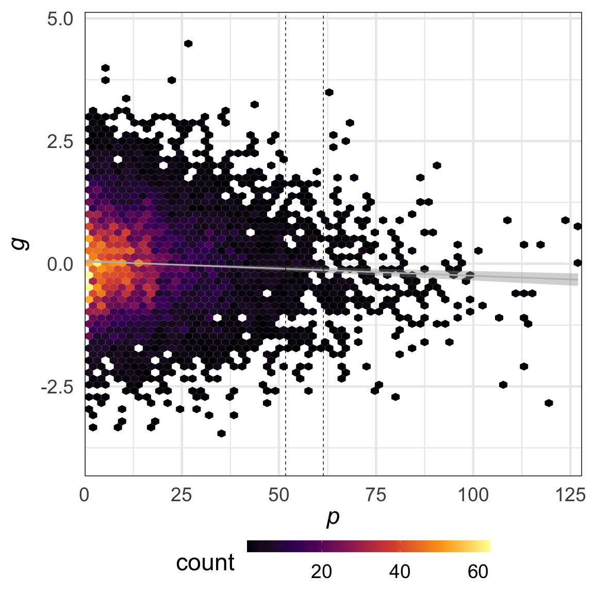<!-- -->

``` r
# extract line of best fit for comparison
fit_data<-ggplot_build(basic)$data[[3]]
lmforBeta<-lm(resids~cbcl_scr_syn_totprob_r,data=plotdf)
lmforBeta
```

    ## 
    ## Call:
    ## lm(formula = resids ~ cbcl_scr_syn_totprob_r, data = plotdf)
    ## 
    ## Coefficients:
    ##            (Intercept)  cbcl_scr_syn_totprob_r  
    ##               0.050310               -0.002952

``` r
# get rs and r^2
# r full
cor.test(plotdf$cbcl_scr_syn_totprob_r,plotdf$resids)
```

    ## 
    ##  Pearson's product-moment correlation
    ## 
    ## data:  plotdf$cbcl_scr_syn_totprob_r and plotdf$resids
    ## t = -5.0729, df = 9448, p-value = 3.993e-07
    ## alternative hypothesis: true correlation is not equal to 0
    ## 95 percent confidence interval:
    ##  -0.07220517 -0.03198986
    ## sample estimates:
    ##         cor 
    ## -0.05211865

``` r
# r^2 full
cor.test(plotdf$cbcl_scr_syn_totprob_r,plotdf$resids)$estimate^2
```

    ##         cor 
    ## 0.002716353

``` r
# rclinical
clindf<-masterdf[as.numeric(masterdf$cbcl_scr_syn_totprob_r)>Pc,]
# same covarying for age
modelforresids<-gam(g~s(interview_age),data=clindf)
clindf$resids<-modelforresids$residuals
cor.test(clindf$cbcl_scr_syn_totprob_r,clindf$resids)
```

    ## 
    ##  Pearson's product-moment correlation
    ## 
    ## data:  clindf$cbcl_scr_syn_totprob_r and clindf$resids
    ## t = -2.6053, df = 268, p-value = 0.009692
    ## alternative hypothesis: true correlation is not equal to 0
    ## 95 percent confidence interval:
    ##  -0.27144889 -0.03851255
    ## sample estimates:
    ##        cor 
    ## -0.1571659

``` r
# r^2 clinical
cor.test(clindf$cbcl_scr_syn_totprob_r,clindf$resids)$estimate^2
```

    ##        cor 
    ## 0.02470111

``` r
# rsubclinical
sclindf<-masterdf[as.numeric(masterdf$cbcl_scr_syn_totprob_r)<Pbc,]
# same covarying for age
modelforresids<-gam(g~s(interview_age),data=sclindf)
sclindf$resids<-modelforresids$residuals
cor.test(sclindf$cbcl_scr_syn_totprob_r,sclindf$resids)
```

    ## 
    ##  Pearson's product-moment correlation
    ## 
    ## data:  sclindf$cbcl_scr_syn_totprob_r and sclindf$resids
    ## t = -1.9933, df = 8977, p-value = 0.04626
    ## alternative hypothesis: true correlation is not equal to 0
    ## 95 percent confidence interval:
    ##  -0.0416995548 -0.0003488777
    ## sample estimates:
    ##         cor 
    ## -0.02103321

``` r
# r^2 subclinical
cor.test(sclindf$cbcl_scr_syn_totprob_r,sclindf$resids)$estimate^2
```

    ##         cor 
    ## 0.000442396

``` r
# ratios
(cor.test(clindf$cbcl_scr_syn_totprob_r,clindf$resids)$estimate^2)/(cor.test(plotdf$cbcl_scr_syn_totprob_r,plotdf$resids)$estimate^2)
```

    ##      cor 
    ## 9.093483

``` r
(cor.test(clindf$cbcl_scr_syn_totprob_r,clindf$resids)$estimate^2)/(cor.test(sclindf$cbcl_scr_syn_totprob_r,sclindf$resids)$estimate^2)
```

    ##      cor 
    ## 55.83485

``` r
# plot out clinical and subclinical with line of best fit, covarying for age
plotdf<-data.frame(clindf$parentPcount,clindf$g,clindf$cbcl_scr_syn_totprob_r,clindf$interview_age)
colnames(plotdf)<-c('parentPcount','g','cbcl_scr_syn_totprob_r','interview_age')
modelforresids<-gam(g~s(interview_age),data=plotdf)
plotdf$resids<-modelforresids$residuals
# clinical
ggplot(data = plotdf,aes(x = cbcl_scr_syn_totprob_r, y = resids)) + geom_hex(bins=30)+
    geom_point(alpha=0)+
    geom_smooth(method = "lm",formula = y~x,color='gray') +
    scale_fill_viridis_c(option = "inferno") +
    ylim(c(-3.9,4.7)) +
    theme_minimal(base_size=35) + 
    ylab(expression(italic(g)))+xlab(expression(italic(p)))+
    geom_vline(xintercept = Pbc, linetype = "dashed")+
    geom_vline(xintercept = min(clindf$cbcl_scr_syn_totprob_r), linetype = "dashed")+
    theme(legend.position = "bottom",panel.border = element_rect(color = "black", fill = NA, size = 1),legend.margin = margin(-25, 0, 0, 0, "pt"),legend.key.width = unit(2.5,"cm"))+
    scale_x_continuous(limits = c(0,128),expand = expansion(mult = c(0, 0)))
```

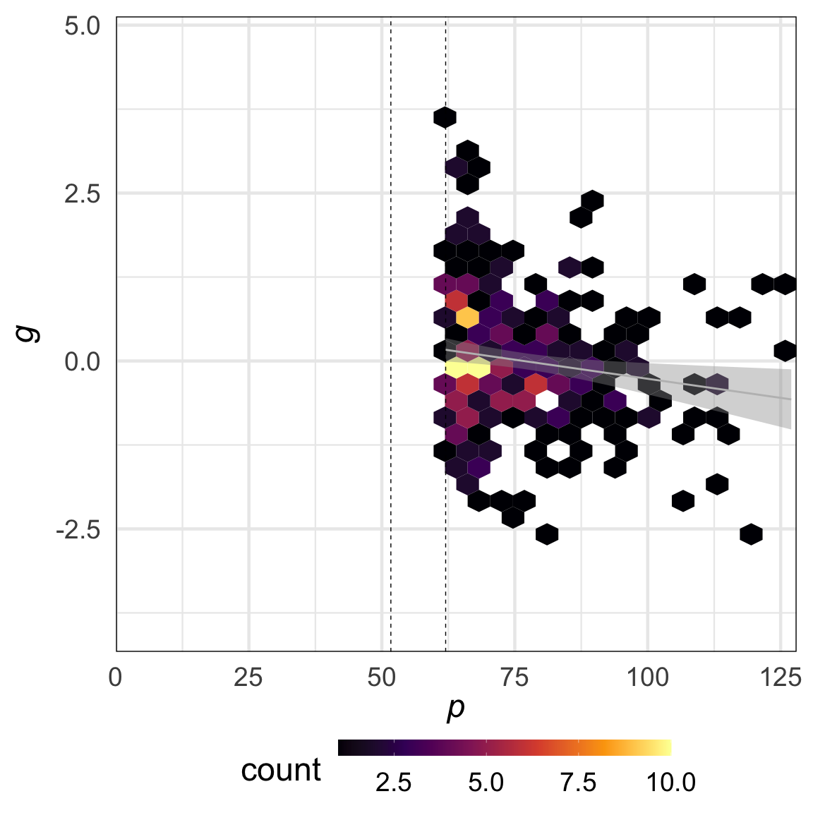<!-- -->

``` r
lmforBeta<-lm(resids~cbcl_scr_syn_totprob_r,data=plotdf)
lmforBeta
```

    ## 
    ## Call:
    ## lm(formula = resids ~ cbcl_scr_syn_totprob_r, data = plotdf)
    ## 
    ## Coefficients:
    ##            (Intercept)  cbcl_scr_syn_totprob_r  
    ##                0.87092                -0.01136

``` r
# subclinical
plotdf<-data.frame(sclindf$parentPcount,sclindf$g,sclindf$cbcl_scr_syn_totprob_r,sclindf$interview_age)
colnames(plotdf)<-c('parentPcount','g','cbcl_scr_syn_totprob_r','interview_age')
modelforresids<-gam(g~s(interview_age),data=plotdf)
plotdf$resids<-modelforresids$residuals
ggplot(data = plotdf,aes(x = cbcl_scr_syn_totprob_r, y = resids)) + geom_hex(bins=40)+
    geom_point(alpha=0)+
    geom_smooth(method = "lm",formula = y~x,color='gray') +
    scale_fill_viridis_c(option = "inferno") +
    ylim(c(-3.9,4.7)) +
    theme_minimal(base_size=35) + 
    ylab(expression(italic(g)))+xlab(expression(italic(p)))+
    geom_vline(xintercept = Pbc, linetype = "dashed")+
    geom_vline(xintercept = min(clindf$cbcl_scr_syn_totprob_r), linetype = "dashed")+
    theme(legend.position = "bottom",panel.border = element_rect(color = "black", fill = NA, size = 1),legend.margin = margin(-25, 0, 0, 0, "pt"),legend.key.width = unit(2.5,"cm"))+
    scale_x_continuous(limits = c(0,128),expand = expansion(mult = c(0, 0)))
```

    ## Warning: Removed 18 rows containing missing values (`geom_hex()`).

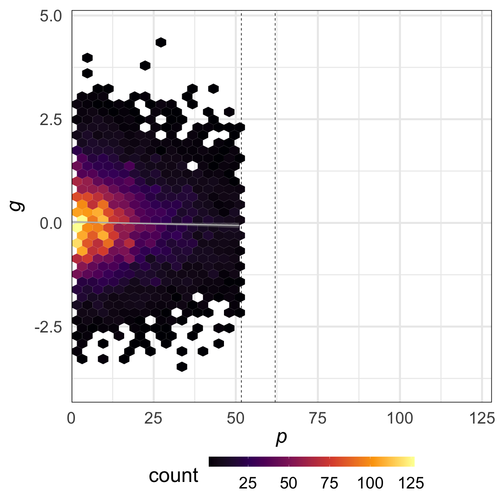<!-- -->

``` r
lmforBeta<-lm(resids~cbcl_scr_syn_totprob_r,data=plotdf)
lmforBeta
```

    ## 
    ## Call:
    ## lm(formula = resids ~ cbcl_scr_syn_totprob_r, data = plotdf)
    ## 
    ## Coefficients:
    ##            (Intercept)  cbcl_scr_syn_totprob_r  
    ##               0.023943               -0.001665

``` r
library(lme4)
```

    ## Loading required package: Matrix

    ## 
    ## Attaching package: 'Matrix'

    ## The following objects are masked from 'package:tidyr':
    ## 
    ##     expand, pack, unpack

    ## 
    ## Attaching package: 'lme4'

    ## The following object is masked from 'package:nlme':
    ## 
    ##     lmList

``` r
# for plot significance testing
masterdf$subjectkey<-as.factor(masterdf$subjectkey)
modelAll<-lme(g~interview_age+cbcl_scr_syn_totprob_r,random=~1|subjectkey,data=masterdf)
summary(modelAll)
```

    ## Linear mixed-effects model fit by REML
    ##   Data: masterdf 
    ##        AIC      BIC    logLik
    ##   21962.11 21997.87 -10976.05
    ## 
    ## Random effects:
    ##  Formula: ~1 | subjectkey
    ##         (Intercept)  Residual
    ## StdDev:    0.830911 0.4707628
    ## 
    ## Fixed effects:  g ~ interview_age + cbcl_scr_syn_totprob_r 
    ##                             Value  Std.Error   DF   t-value p-value
    ## (Intercept)            -2.0962733 0.05503773 4724 -38.08793  0.0000
    ## interview_age           0.1971942 0.00473534 4723  41.64311  0.0000
    ## cbcl_scr_syn_totprob_r -0.0016757 0.00056713 4723  -2.95468  0.0031
    ##  Correlation: 
    ##                        (Intr) intrv_
    ## interview_age          -0.956       
    ## cbcl_scr_syn_totprob_r -0.252  0.081
    ## 
    ## Standardized Within-Group Residuals:
    ##         Min          Q1         Med          Q3         Max 
    ## -3.58945110 -0.49569233 -0.02767645  0.46829730  3.31431044 
    ## 
    ## Number of Observations: 9450
    ## Number of Groups: 4725

``` r
# model just clinical
modelClin<-lme(g~interview_age+cbcl_scr_syn_totprob_r,random=~1|subjectkey,data=clindf)
summary(modelClin)
```

    ## Linear mixed-effects model fit by REML
    ##   Data: clindf 
    ##        AIC     BIC    logLik
    ##   740.5088 758.445 -365.2544
    ## 
    ## Random effects:
    ##  Formula: ~1 | subjectkey
    ##         (Intercept)  Residual
    ## StdDev:   0.8172449 0.5412928
    ## 
    ## Fixed effects:  g ~ interview_age + cbcl_scr_syn_totprob_r 
    ##                             Value Std.Error  DF   t-value p-value
    ## (Intercept)            -1.9217395 0.5068513 209 -3.791525  0.0002
    ## interview_age           0.2092151 0.0385978  58  5.420393  0.0000
    ## cbcl_scr_syn_totprob_r -0.0078344 0.0036615  58 -2.139643  0.0366
    ##  Correlation: 
    ##                        (Intr) intrv_
    ## interview_age          -0.826       
    ## cbcl_scr_syn_totprob_r -0.555  0.008
    ## 
    ## Standardized Within-Group Residuals:
    ##         Min          Q1         Med          Q3         Max 
    ## -1.97181530 -0.39843698 -0.05896922  0.41063833  2.97124115 
    ## 
    ## Number of Observations: 270
    ## Number of Groups: 210

``` r
# model just subclinical
modelSClin<-lme(g~interview_age+cbcl_scr_syn_totprob_r,random=~1|subjectkey,data=sclindf)
summary(modelSClin)
```

    ## Linear mixed-effects model fit by REML
    ##   Data: sclindf 
    ##       AIC      BIC    logLik
    ##   20958.7 20994.21 -10474.35
    ## 
    ## Random effects:
    ##  Formula: ~1 | subjectkey
    ##         (Intercept) Residual
    ## StdDev:   0.8311038 0.469937
    ## 
    ## Fixed effects:  g ~ interview_age + cbcl_scr_syn_totprob_r 
    ##                             Value  Std.Error   DF   t-value p-value
    ## (Intercept)            -2.1138154 0.05737405 4613 -36.84271     0.0
    ## interview_age           0.1983609 0.00490051 4363  40.47761     0.0
    ## cbcl_scr_syn_totprob_r -0.0012735 0.00077412 4363  -1.64512     0.1
    ##  Correlation: 
    ##                        (Intr) intrv_
    ## interview_age          -0.953       
    ## cbcl_scr_syn_totprob_r -0.280  0.086
    ## 
    ## Standardized Within-Group Residuals:
    ##        Min         Q1        Med         Q3        Max 
    ## -3.5932176 -0.4921753 -0.0315859  0.4614297  3.0071721 
    ## 
    ## Number of Observations: 8979
    ## Number of Groups: 4614

``` r
library(ggplot2)
library(gganimate)
library(dplyr)

# Calculate percentiles and create a new column for grouping
percentile_df <- plotdf %>%
  mutate(percentile_group = cut_interval(cbcl_scr_syn_totprob_r, n = 4, labels = FALSE))

# Calculate beta values for each percentile group
corr_values <- list()
for (pg in unique(percentile_df$percentile_group)) {
  data = percentile_df %>% filter(percentile_group == pg)
  lm_model <- cor.test(data$resids,data$cbcl_scr_syn_totprob_r)
  corr_values[[as.character(pg)]] <- lm_model[4]
}

# Create a data frame for beta annotation
beta_df <- data.frame(percentile_group = unique(percentile_df$percentile_group),
                      beta = unlist(corr_values))

# Create the animated plot
animated_plot <- ggplot(percentile_df, aes(x = cbcl_scr_syn_totprob_r, y = resids)) +
  geom_hex(bins = 60) +
  geom_point(alpha = 0) +
  geom_smooth(method = "lm", formula = y ~ x, color = '#e8e6e6', size = 2) +
  scale_fill_viridis_c(option = "inferno") +
  ylim(c(-3.9, 4.7)) +
  theme_minimal(base_size = 35) +
  ylab('General Cognition') + xlab('General Psychopathology') +
  geom_vline(xintercept = Pbc, linetype = "dashed") +
  geom_vline(xintercept = Pc, linetype = "dashed") +
  theme(legend.position = "bottom", panel.border = element_rect(color = "black", fill = NA, size = 1),
        legend.margin = margin(-25, 0, 0, 0, "pt"), legend.key.width = unit(2.5, "cm")) +
  scale_x_continuous(limits = c(0, 110), expand = expansion(mult = c(0, 0))) +
  transition_states(percentile_group, transition_length = 2) +
  enter_fade() +
  exit_fade()
```

    ## Warning: Using `size` aesthetic for lines was deprecated in ggplot2 3.4.0.
    ## ℹ Please use `linewidth` instead.
    ## This warning is displayed once every 8 hours.
    ## Call `lifecycle::last_lifecycle_warnings()` to see where this warning was
    ## generated.

``` r
# Create the animation with corr annotation
animated_plot <- animated_plot +
  theme(plot.title = element_text(size = 12)) +
  geom_text(data = beta_df,
            aes(x = 80, y = 4, label = sprintf("Corr = %.2f", beta)),
            size = 6, color = "black")

# Save the animation as a GIF
anim_save(
  filename = "gp_corr.gif",
  animation = animated_plot,
  width = 520,  # Set the desired width in pixels
  height = 520,  # Set the desired height in pixels
  renderer = gifski_renderer()
)
```

    ## Warning: Removed 24 rows containing missing values (`geom_hex()`).

    ## Warning: Removed 24 rows containing missing values (`geom_hex()`).
    ## Removed 24 rows containing missing values (`geom_hex()`).
    ## Removed 24 rows containing missing values (`geom_hex()`).
    ## Removed 24 rows containing missing values (`geom_hex()`).
    ## Removed 24 rows containing missing values (`geom_hex()`).
    ## Removed 24 rows containing missing values (`geom_hex()`).
    ## Removed 24 rows containing missing values (`geom_hex()`).
    ## Removed 24 rows containing missing values (`geom_hex()`).
    ## Removed 24 rows containing missing values (`geom_hex()`).
    ## Removed 24 rows containing missing values (`geom_hex()`).
    ## Removed 24 rows containing missing values (`geom_hex()`).
    ## Removed 24 rows containing missing values (`geom_hex()`).
    ## Removed 24 rows containing missing values (`geom_hex()`).
    ## Removed 24 rows containing missing values (`geom_hex()`).
    ## Removed 24 rows containing missing values (`geom_hex()`).
    ## Removed 24 rows containing missing values (`geom_hex()`).
    ## Removed 24 rows containing missing values (`geom_hex()`).
    ## Removed 24 rows containing missing values (`geom_hex()`).
    ## Removed 24 rows containing missing values (`geom_hex()`).
    ## Removed 24 rows containing missing values (`geom_hex()`).
    ## Removed 24 rows containing missing values (`geom_hex()`).
    ## Removed 24 rows containing missing values (`geom_hex()`).
    ## Removed 24 rows containing missing values (`geom_hex()`).
    ## Removed 24 rows containing missing values (`geom_hex()`).
    ## Removed 24 rows containing missing values (`geom_hex()`).
    ## Removed 24 rows containing missing values (`geom_hex()`).
    ## Removed 24 rows containing missing values (`geom_hex()`).
    ## Removed 24 rows containing missing values (`geom_hex()`).
    ## Removed 24 rows containing missing values (`geom_hex()`).
    ## Removed 24 rows containing missing values (`geom_hex()`).
    ## Removed 24 rows containing missing values (`geom_hex()`).
    ## Removed 24 rows containing missing values (`geom_hex()`).
    ## Removed 24 rows containing missing values (`geom_hex()`).
    ## Removed 24 rows containing missing values (`geom_hex()`).
    ## Removed 24 rows containing missing values (`geom_hex()`).
    ## Removed 24 rows containing missing values (`geom_hex()`).
    ## Removed 24 rows containing missing values (`geom_hex()`).
    ## Removed 24 rows containing missing values (`geom_hex()`).
    ## Removed 24 rows containing missing values (`geom_hex()`).
    ## Removed 24 rows containing missing values (`geom_hex()`).
    ## Removed 24 rows containing missing values (`geom_hex()`).

``` r
# insert subclinical vs. clincal bootstrapped betas as horizontal box-and-whiskers,consider adding permuted vs. median observed difference
### ∆∆∆∆∆∆∆∆
# actual beta fits are under gp_CvSC_bootBetas
Fits1=readRDS('~/Desktop/g_p/gp_CvSC_bootBetas1.rds')
Fits2=readRDS('~/Desktop/g_p/gp_CvSC_bootBetas2.rds')
Fits3=readRDS('~/Desktop/g_p/gp_CvSC_bootBetas3.rds')
Fits4=readRDS('~/Desktop/g_p/gp_CvSC_bootBetas4.rds')
Fits5=readRDS('~/Desktop/g_p/gp_CvSC_bootBetas5.rds')
Fits1[2001:4000,]=Fits2[2001:4000,]
Fits1[4001:6000,]=Fits3[4001:6000,]
Fits1[6001:8000,]=Fits4[6001:8000,]
Fits1[8001:10000,]=Fits5[8001:10000,]

# get differences in betas between real and permuted clinical groups
Diffs1=readRDS('~/Desktop/g_p/gp_CvSC_diffs1.rds')
Diffs2=readRDS('~/Desktop/g_p/gp_CvSC_diffs2.rds')
Diffs3=readRDS('~/Desktop/g_p/gp_CvSC_diffs3.rds')
Diffs4=readRDS('~/Desktop/g_p/gp_CvSC_diffs4.rds')
Diffs5=readRDS('~/Desktop/g_p/gp_CvSC_diffs5.rds')
Diffs1[2001:4000,]=Diffs2[2001:4000,]
Diffs1[4001:6000,]=Diffs3[4001:6000,]
Diffs1[6001:8000,]=Diffs4[6001:8000,]
Diffs1[8001:10000,]=Diffs5[8001:10000,]
```

``` r
# make horizontal box and whiskers for betas from clinical and subclincal for each scale
# denote significance using observed beta difference vs. permutations

# P
FitsP_long <- Fits1 %>%
  select(pSubclinBeta,pClinBeta) %>%
  tidyr::gather(key = "Variable", value = "Value")
# create cleaner labels for plot
FitsP_long <- FitsP_long %>%
  mutate(Labels = factor(ifelse(Variable == 'pSubclinBeta', 'Subclinical', 'Clinical')))
# re order for plot
FitsP_long$Labels <- factor(FitsP_long$Labels, levels = c("Subclinical", "Clinical"))
# get median values
medianClin=median(FitsP_long$Value[FitsP_long$Labels=='Clinical'])
medianSClin=median(FitsP_long$Value[FitsP_long$Labels=='Subclinical'])
FitsP_long$Median=NULL
FitsP_long$Median[FitsP_long$Labels=='Clinical']=medianClin
FitsP_long$Median[FitsP_long$Labels=='Subclinical']=medianSClin
# Plotting both pClinBeta and pSubclinBeta in the same horizontal boxplot
ggplot(FitsP_long, aes(x = Labels, y = Value, fill = Median)) +
  geom_boxplot() +
  coord_flip() +
  scale_fill_gradient2(
    low = "blue", mid = "white", high = "red",
    midpoint = 0, limits = c(-0.1, 0.1)
  )+
  labs(title = expression(paste("\u03B2 for ", italic("p")))) +
  theme_minimal(base_size = 26)+theme(axis.title.y = element_blank())
```

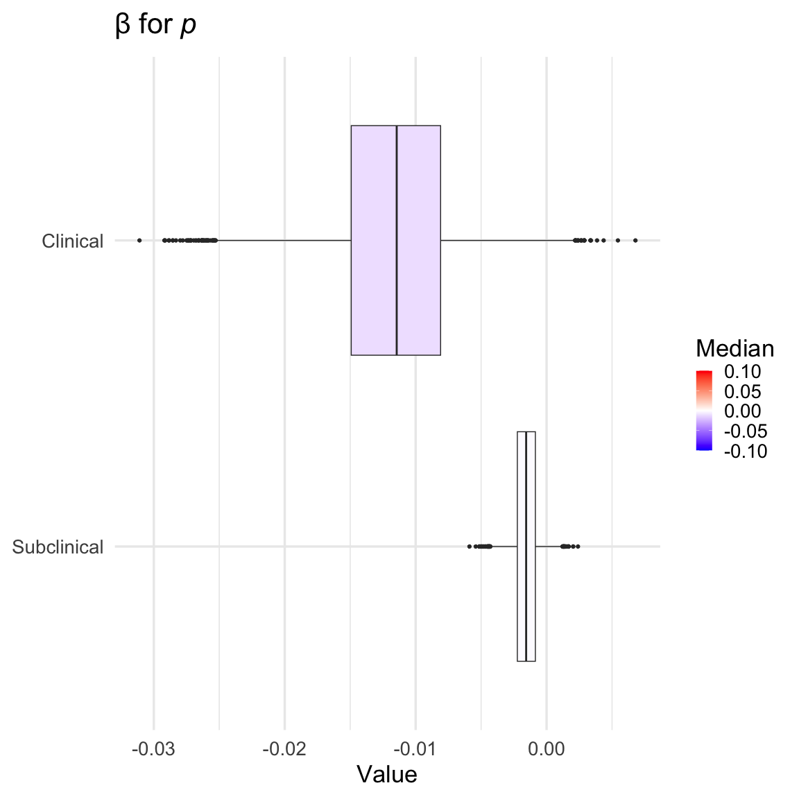<!-- -->

``` r
# saved at 700 width 300 height

# INT
# Plotting both intClinBeta and intSubclinBeta in the same horizontal boxplot
FitsInt_long <- Fits1 %>%
  select(intSubclinBeta,intClinBeta) %>%
  tidyr::gather(key = "Variable", value = "Value")
# create cleaner labels for plot
FitsInt_long <- FitsInt_long %>%
  mutate(Labels = factor(ifelse(Variable == 'intSubclinBeta', 'Subclinical', 'Clinical')))
# re order for plot
FitsInt_long$Labels <- factor(FitsInt_long$Labels, levels = c("Subclinical", "Clinical"))
# get median values
medianClin=median(FitsInt_long$Value[FitsInt_long$Labels=='Clinical'])
medianSClin=median(FitsInt_long$Value[FitsInt_long$Labels=='Subclinical'])
FitsInt_long$Median=NULL
FitsInt_long$Median[FitsInt_long$Labels=='Clinical']=medianClin
FitsInt_long$Median[FitsInt_long$Labels=='Subclinical']=medianSClin
# Plotting both pClinBeta and pSubclinBeta in the same horizontal boxplot
ggplot(FitsInt_long, aes(x = Labels, y = Value, fill = Median)) +
  geom_boxplot() +
  coord_flip() +
  scale_fill_gradient2(
    low = "blue", mid = "white", high = "red",
    midpoint = 0, limits = c(-0.1, 0.1)
  )+
  labs(title = expression(paste("\u03B2 for Int."))) +
  theme_minimal(base_size = 26)+theme(axis.title.y = element_blank())
```

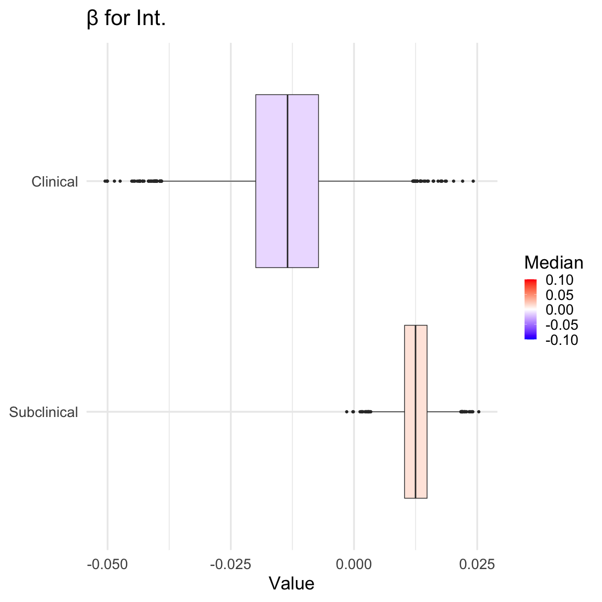<!-- -->

``` r
# Ext
# Plotting both intClinBeta and intSubclinBeta in the same horizontal boxplot
FitsExt_long <- Fits1 %>%
  select(extSubclinBeta,extClinBeta) %>%
  tidyr::gather(key = "Variable", value = "Value")
# create cleaner labels for plot
FitsExt_long <- FitsExt_long %>%
  mutate(Labels = factor(ifelse(Variable == 'extSubclinBeta', 'Subclinical', 'Clinical')))
# re order for plot
FitsExt_long$Labels <- factor(FitsExt_long$Labels, levels = c("Subclinical", "Clinical"))
# get median values
medianClin=median(FitsExt_long$Value[FitsExt_long$Labels=='Clinical'])
medianSClin=median(FitsExt_long$Value[FitsExt_long$Labels=='Subclinical'])
FitsExt_long$Median=NULL
FitsExt_long$Median[FitsExt_long$Labels=='Clinical']=medianClin
FitsExt_long$Median[FitsExt_long$Labels=='Subclinical']=medianSClin
# Plotting both pClinBeta and pSubclinBeta in the same horizontal boxplot
ggplot(FitsExt_long, aes(x = Labels, y = Value, fill = Median)) +
  geom_boxplot() +
  coord_flip() +
    scale_fill_gradient2(
    low = "blue", mid = "white", high = "red",
    midpoint = 0, limits = c(-0.1, 0.1)
  )+
  labs(title = expression(paste("\u03B2 for Ext."))) +
  theme_minimal(base_size = 26)+theme(axis.title.y = element_blank())
```

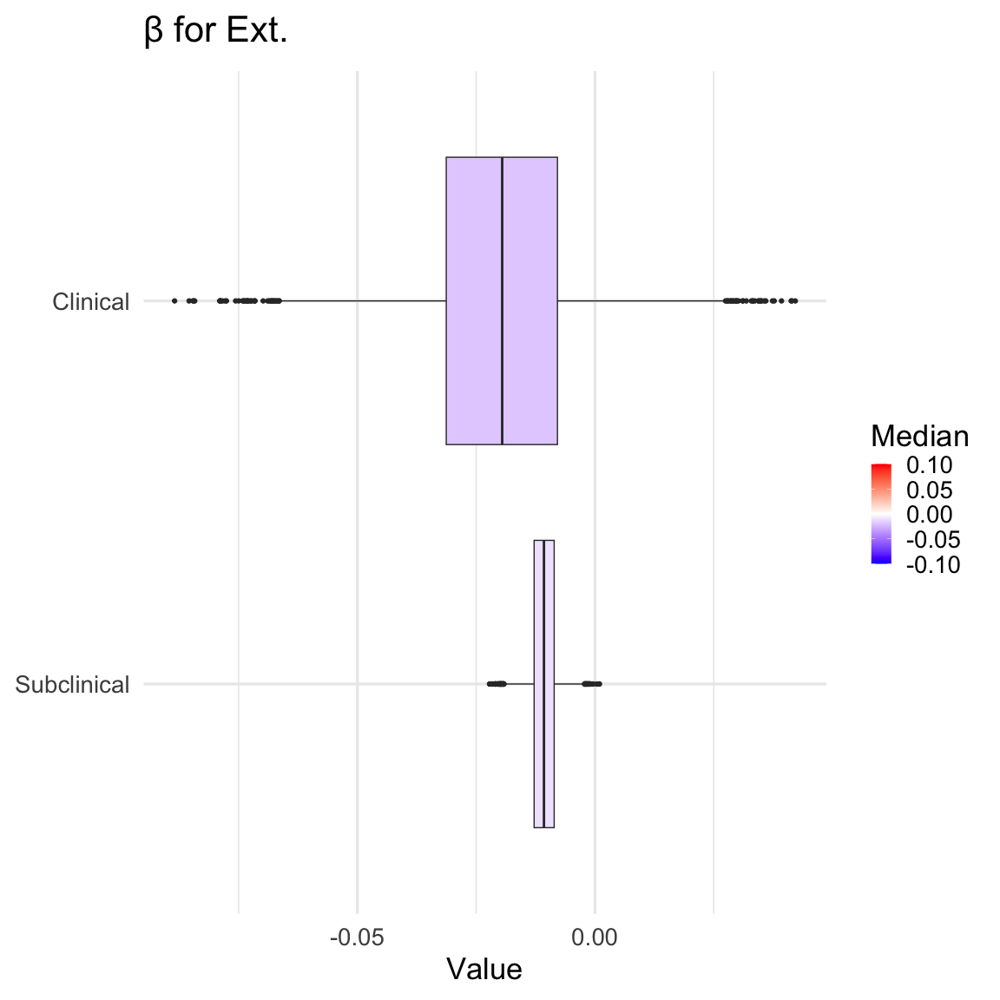<!-- -->

``` r
library(ggridges)

# make plots of linear model comparison 
# Create a new data frame with the first 10,000 rows
df_subset <- Diffs1[1:10000,1:3]

# Melt the data frame for easier plotting
df_melted <- reshape2::melt(df_subset)
```

    ## No id variables; using all as measure variables

``` r
# Create a data frame with the 10,001st row for annotation
df_10001 <- data.frame(variable = names(Diffs1[1:3]), value = as.numeric(Diffs1[10001,1:3]))

# Plot the distribution for each column with the 10,001st value marked distinctly
ggplot(df_melted, aes(x = value, y = variable)) +
  geom_density_ridges(rel_min_height=0.01) +
  geom_point(data = df_10001, aes(x = value, y = variable), color = "red", size = 3) +
  labs(title = "Distribution of Values with 10,001st Value Marked",
       x = "Density",
       y = "Columns")
```

    ## Picking joint bandwidth of 0.00153

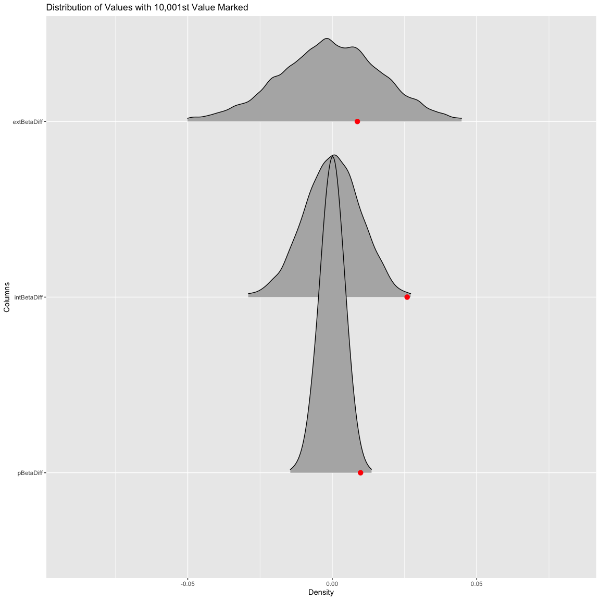<!-- -->

``` r
# manually derive p-values
ps=NULL
for (i in 1:3){
  ps[i]=sum((df_subset[,i])>df_10001[i,2])/10000
}
```

``` r
### P boots plot with overlaid linear fit
# load in data
Fits1=readRDS('~/Desktop/g_p/gpFitBoots_cbclasr1.rds')
Fits2=readRDS('~/Desktop/g_p/gpFitBoots_cbclasr2.rds')
Fits3=readRDS('~/Desktop/g_p/gpFitBoots_cbclasr3.rds')
Fits4=readRDS('~/Desktop/g_p/gpFitBoots_cbclasr4.rds')
Fits5=readRDS('~/Desktop/g_p/gpFitBoots_cbclasr5.rds')
Fits1[2001:4000,]=Fits2[2001:4000,]
Fits1[4001:6000,]=Fits3[4001:6000,]
Fits1[6001:8000,]=Fits4[6001:8000,]
Fits1[8001:10000,]=Fits5[8001:10000,]

# extract p factor
PFits=Fits1[,1:128]
MaxP=find_furthest_nonzero(PFits)
# melt data for plotting each line
data_melt <- melt(t(PFits))
data_melt$Var1 <- rep(seq(0, 127), nrow(PFits))
# Calculate percentiles
percentiles <- PFits %>%
summarise(across(everything(), quantile, probs = c(0.01, 0.99), na.rm = TRUE))
```

    ## Warning: There was 1 warning in `summarise()`.
    ## ℹ In argument: `across(everything(), quantile, probs = c(0.01, 0.99), na.rm =
    ##   TRUE)`.
    ## Caused by warning:
    ## ! The `...` argument of `across()` is deprecated as of dplyr 1.1.0.
    ## Supply arguments directly to `.fns` through an anonymous function instead.
    ## 
    ##   # Previously
    ##   across(a:b, mean, na.rm = TRUE)
    ## 
    ##   # Now
    ##   across(a:b, \(x) mean(x, na.rm = TRUE))

    ## Warning: Returning more (or less) than 1 row per `summarise()` group was deprecated in
    ## dplyr 1.1.0.
    ## ℹ Please use `reframe()` instead.
    ## ℹ When switching from `summarise()` to `reframe()`, remember that `reframe()`
    ##   always returns an ungrouped data frame and adjust accordingly.
    ## Call `lifecycle::last_lifecycle_warnings()` to see where this warning was
    ## generated.

``` r
percentiles_long <- tidyr::pivot_longer(percentiles, cols = everything(), names_to = "Percentile", values_to = "YValue")

# Add CI column
data_melt$CI <- 0
  
# Prepare CIs for insertion
CIs <- data.frame(rep(seq(0, 127), 2), c(rep(10001, 128), rep(10002, 128)), percentiles_long$YValue, rep(1, (128*2)))
colnames(CIs) <- colnames(data_melt)
  
# Add CIs
data_melt2 <- rbind(data_melt, CIs)
  
# Convert CI column to factor
data_melt2$CI <- as.factor(data_melt2$CI)
  

# add in var2, only length of 80
fit_data$Var2=rep(10003,80)

# saved out at 600x600

# Plotting the lines
ggplot(data = data_melt2, aes(x = Var1, y = value, group = Var2)) +
  geom_line(aes(alpha = CI, color = Var2), show.legend = FALSE) +
  scale_color_viridis_c(option = "inferno", direction = -1) +
  scale_alpha_manual(values = c(0.01, 1), guide = FALSE) + ylim(c(-1.5,1.5)) +
  theme_minimal(base_size=35) + 
  ylab(expression(italic(g)))+xlab(expression(italic(p)))+
  geom_vline(xintercept = Pbc, linetype = "dashed")+
  geom_vline(xintercept = Pc, linetype = "dashed")+
  theme(panel.border = element_rect(color = "black", fill = NA, size = 1)) +
  scale_x_continuous(limits = c(0,MaxP),expand = expansion(mult = c(0, 0))) + 
  geom_line(data = fit_data, aes(x = x, y = y), color = "gray",size=1.5)
```

    ## Warning: Removed 160032 rows containing missing values (`geom_line()`).

    ## Warning: Removed 10 rows containing missing values (`geom_line()`).

    ## Warning: The `guide` argument in `scale_*()` cannot be `FALSE`. This was deprecated in
    ## ggplot2 3.3.4.
    ## ℹ Please use "none" instead.
    ## This warning is displayed once every 8 hours.
    ## Call `lifecycle::last_lifecycle_warnings()` to see where this warning was
    ## generated.

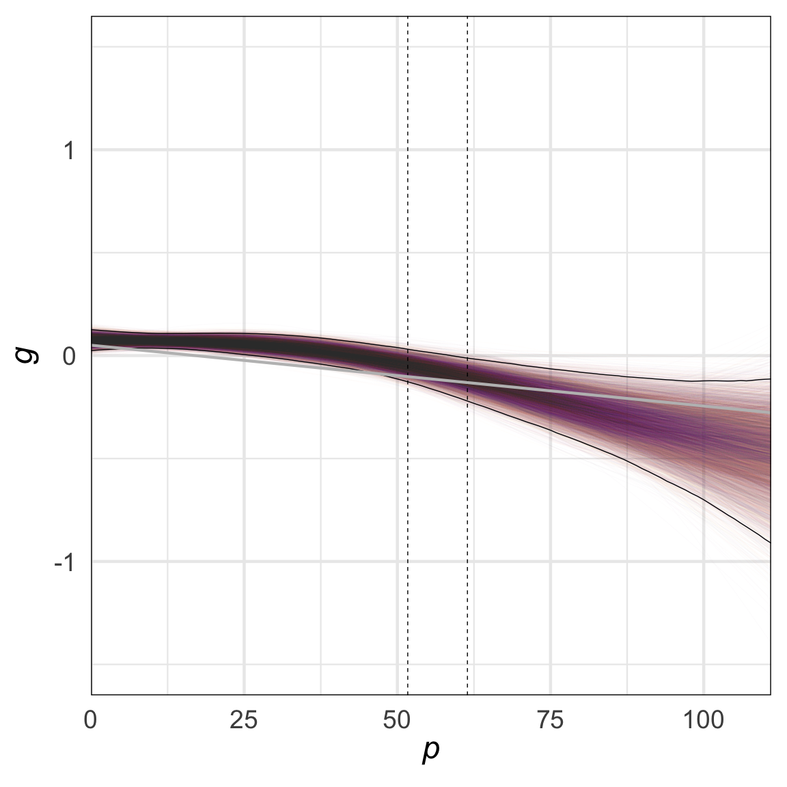<!-- -->

``` r
# set Fits1 to Fits for simplicity
Fits=Fits1
# find mean shape and plot it: p
PFits=Fits[,1:128]
IFits=Fits[,129:180]
EFits=Fits[,181:228]
SomFits=Fits[,229:242]
AnxFits=Fits[,243:268]
ThoFits=Fits[,269:287]
WitFits=Fits[,288:304]
SocFits=Fits[,305:322]
AttFits=Fits[,323:342]
RulFits=Fits[,343:361]
AggFits=Fits[,362:394]

# set to 99th percentile for accuracy
MaxP=quantile(masterdf$cbcl_scr_syn_totprob_r,.99)
MaxI=quantile(masterdf$cbcl_scr_syn_internal_r,.99)
MaxE=quantile(masterdf$cbcl_scr_syn_external_r,.99)
MaxAnx=quantile(masterdf$cbcl_scr_syn_anxdep_r,.99)
MaxTho=quantile(masterdf$cbcl_scr_syn_thought_r,.99)
MaxWit=quantile(masterdf$cbcl_scr_syn_withdep_r,.99)
MaxSoc=quantile(masterdf$cbcl_scr_syn_social_r,.99)
MaxSom=quantile(masterdf$cbcl_scr_syn_somatic_r,.99)
MaxAtt=quantile(masterdf$cbcl_scr_syn_attention_r,.99)
MaxRul=quantile(masterdf$cbcl_scr_syn_rulebreak_r,.99)
MaxAgg=quantile(masterdf$cbcl_scr_syn_aggressive_r,.99)

# pull clinical cutoff from master df: t scores > 65 = borderline clinical, 69 = clinical
masterdfP_bc<-masterdf[masterdf$cbcl_scr_syn_totprob_t==65,]
masterdfP_c<-masterdf[masterdf$cbcl_scr_syn_totprob_t==69,]
masterdfI_bc<-masterdf[masterdf$cbcl_scr_syn_internal_t==65,]
masterdfI_c<-masterdf[masterdf$cbcl_scr_syn_internal_t==69,]
masterdfE_bc<-masterdf[masterdf$cbcl_scr_syn_external_t==65,]
masterdfE_c<-masterdf[masterdf$cbcl_scr_syn_external_t==69,]
masterdfAnx_bc<-masterdf[masterdf$cbcl_scr_syn_anxdep_t==65,]
masterdfAnx_c<-masterdf[masterdf$cbcl_scr_syn_anxdep_t==69,]
# note no one has t==65 in this dataset for thought
masterdfTho_bc<-masterdf[masterdf$cbcl_scr_syn_thought_t==66,]
masterdfTho_c<-masterdf[masterdf$cbcl_scr_syn_thought_t==69,]
# note no one has t==65 in this dataset for withdrawn depression
masterdfWit_bc<-masterdf[masterdf$cbcl_scr_syn_withdep_t==66,]
masterdfWit_c<-masterdf[masterdf$cbcl_scr_syn_withdep_t==69,]
masterdfSom_bc<-masterdf[masterdf$cbcl_scr_syn_somatic_t==65,]
# no one has t==69
masterdfSom_c<-masterdf[masterdf$cbcl_scr_syn_somatic_t==70,]
masterdfSoc_bc<-masterdf[masterdf$cbcl_scr_syn_social_t==65,]
masterdfSoc_c<-masterdf[masterdf$cbcl_scr_syn_social_t==69,]
masterdfAtt_bc<-masterdf[masterdf$cbcl_scr_syn_attention_t==65,]
masterdfAtt_c<-masterdf[masterdf$cbcl_scr_syn_attention_t==69,]
masterdfRul_bc<-masterdf[masterdf$cbcl_scr_syn_rulebreak_t==65,]
masterdfRul_c<-masterdf[masterdf$cbcl_scr_syn_rulebreak_t==69,]
masterdfAgg_bc<-masterdf[masterdf$cbcl_scr_syn_aggressive_t==65,]
masterdfAgg_c<-masterdf[masterdf$cbcl_scr_syn_aggressive_t==69,]

# borderline clinical and clinical cutoffs
Pbc=mean(masterdfP_bc$cbcl_scr_syn_totprob_r)
Pc=mean(masterdfP_c$cbcl_scr_syn_totprob_r)
Ibc=mean(masterdfP_bc$cbcl_scr_syn_internal_r)
Ic=mean(masterdfP_c$cbcl_scr_syn_internal_r)
Ebc=mean(masterdfE_bc$cbcl_scr_syn_external_r)
Ec=mean(masterdfE_c$cbcl_scr_syn_external_r)
AnxBc=mean(as.numeric(masterdfAnx_bc$cbcl_scr_syn_anxdep_r))
AnxC=mean(as.numeric(masterdfAnx_c$cbcl_scr_syn_anxdep_r))
ThoBc=mean(as.numeric(masterdfTho_bc$cbcl_scr_syn_thought_r))
ThoC=mean(as.numeric(masterdfTho_c$cbcl_scr_syn_thought_r))
WitBc=mean(as.numeric(masterdfWit_bc$cbcl_scr_syn_withdep_r))
WitC=mean(as.numeric(masterdfWit_c$cbcl_scr_syn_withdep_r))
SomBc=mean(as.numeric(masterdfSom_bc$cbcl_scr_syn_somatic_r))
SomC=mean(as.numeric(masterdfSom_c$cbcl_scr_syn_somatic_r))
SocBc=mean(as.numeric(masterdfSom_bc$cbcl_scr_syn_social_r))
SocC=mean(as.numeric(masterdfSoc_c$cbcl_scr_syn_social_r))
AttBc=mean(as.numeric(masterdfAtt_bc$cbcl_scr_syn_attention_r))
AttC=mean(as.numeric(masterdfAtt_c$cbcl_scr_syn_attention_r))
RulBc=mean(as.numeric(masterdfRul_bc$cbcl_scr_syn_rulebreak_r))
RulC=mean(as.numeric(masterdfRul_c$cbcl_scr_syn_rulebreak_r))
AggBc=mean(as.numeric(masterdfAgg_bc$cbcl_scr_syn_aggressive_r))
AggC=mean(as.numeric(masterdfAgg_c$cbcl_scr_syn_aggressive_r))

# actually plot em
plot_bootstraps(PFits,127,expression(italic(p)),MaxP,Pbc,Pc)
```

    ## Warning: Returning more (or less) than 1 row per `summarise()` group was deprecated in
    ## dplyr 1.1.0.
    ## ℹ Please use `reframe()` instead.
    ## ℹ When switching from `summarise()` to `reframe()`, remember that `reframe()`
    ##   always returns an ungrouped data frame and adjust accordingly.
    ## Call `lifecycle::last_lifecycle_warnings()` to see where this warning was
    ## generated.

    ## Warning: Removed 480096 rows containing missing values (`geom_line()`).

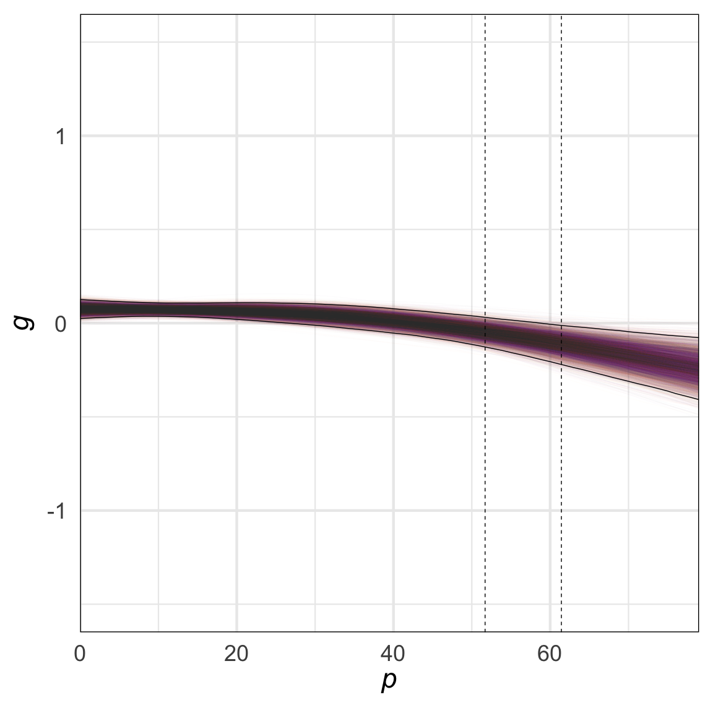<!-- -->

``` r
plot_bootstraps(IFits,51,'Internalizing',MaxI,Ibc,Ic)
```

    ## Warning: Returning more (or less) than 1 row per `summarise()` group was deprecated in
    ## dplyr 1.1.0.
    ## ℹ Please use `reframe()` instead.
    ## ℹ When switching from `summarise()` to `reframe()`, remember that `reframe()`
    ##   always returns an ungrouped data frame and adjust accordingly.
    ## Call `lifecycle::last_lifecycle_warnings()` to see where this warning was
    ## generated.

    ## Warning: Removed 260052 rows containing missing values (`geom_line()`).

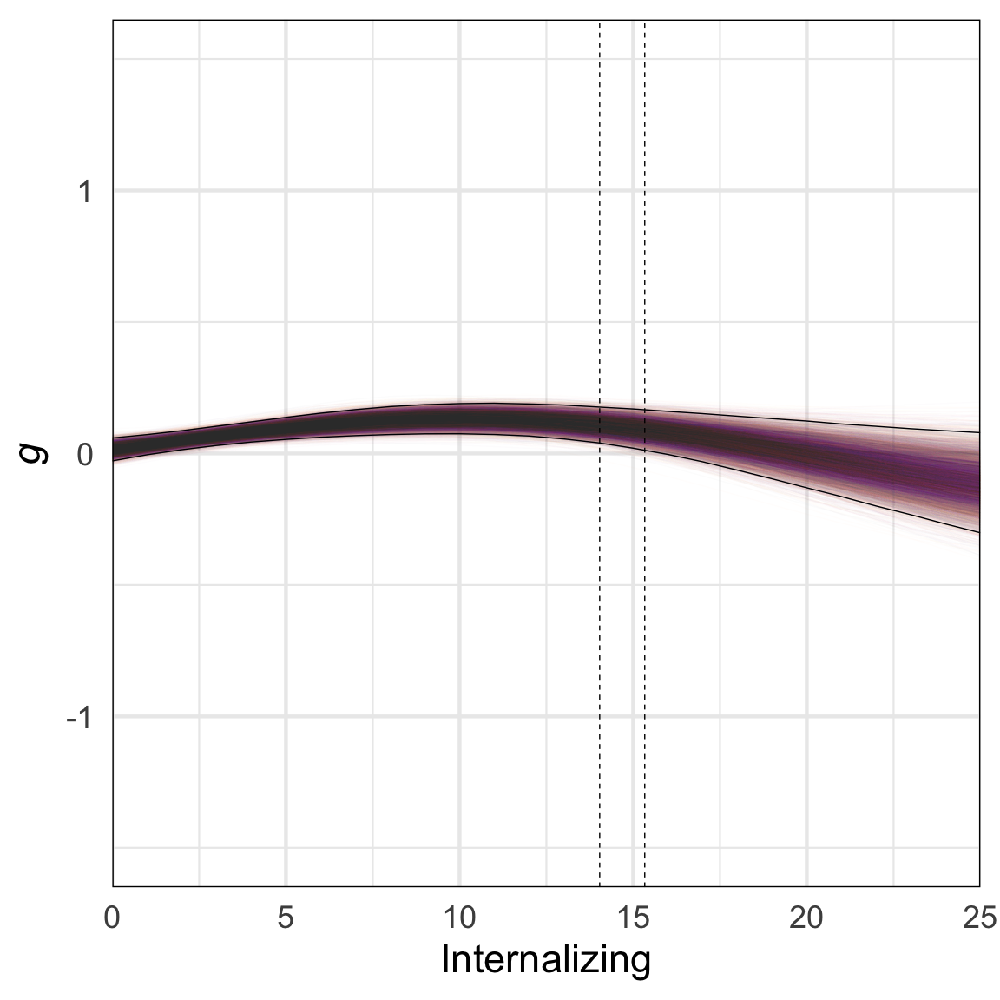<!-- -->

``` r
plot_bootstraps(EFits,47,'Externalizing',MaxE,Ebc,Ec)
```

    ## Warning: Returning more (or less) than 1 row per `summarise()` group was deprecated in
    ## dplyr 1.1.0.
    ## ℹ Please use `reframe()` instead.
    ## ℹ When switching from `summarise()` to `reframe()`, remember that `reframe()`
    ##   always returns an ungrouped data frame and adjust accordingly.
    ## Call `lifecycle::last_lifecycle_warnings()` to see where this warning was
    ## generated.

    ## Warning: Removed 220044 rows containing missing values (`geom_line()`).

<!-- -->

``` r
# for supplemental figure
plot_bootstraps(SomFits,13,"Somatic",MaxSom,SomBc,SomC)
```

    ## Warning: Returning more (or less) than 1 row per `summarise()` group was deprecated in
    ## dplyr 1.1.0.
    ## ℹ Please use `reframe()` instead.
    ## ℹ When switching from `summarise()` to `reframe()`, remember that `reframe()`
    ##   always returns an ungrouped data frame and adjust accordingly.
    ## Call `lifecycle::last_lifecycle_warnings()` to see where this warning was
    ## generated.

    ## Warning: Removed 50010 rows containing missing values (`geom_line()`).

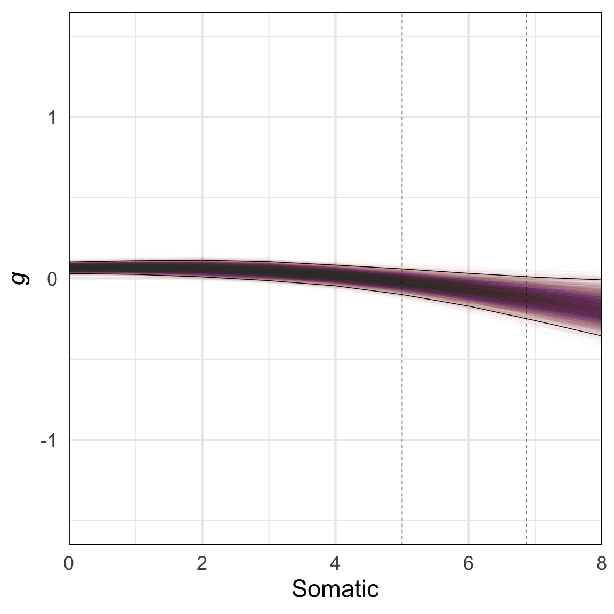<!-- -->

``` r
plot_bootstraps(AnxFits,25,'Anxious Depression',MaxAnx,AnxBc,AnxC)
```

    ## Warning: Returning more (or less) than 1 row per `summarise()` group was deprecated in
    ## dplyr 1.1.0.
    ## ℹ Please use `reframe()` instead.
    ## ℹ When switching from `summarise()` to `reframe()`, remember that `reframe()`
    ##   always returns an ungrouped data frame and adjust accordingly.
    ## Call `lifecycle::last_lifecycle_warnings()` to see where this warning was
    ## generated.

    ## Warning: Removed 120024 rows containing missing values (`geom_line()`).

<!-- -->

``` r
plot_bootstraps(ThoFits,18,'Thought',MaxTho,ThoBc,ThoC)
```

    ## Warning: Returning more (or less) than 1 row per `summarise()` group was deprecated in
    ## dplyr 1.1.0.
    ## ℹ Please use `reframe()` instead.
    ## ℹ When switching from `summarise()` to `reframe()`, remember that `reframe()`
    ##   always returns an ungrouped data frame and adjust accordingly.
    ## Call `lifecycle::last_lifecycle_warnings()` to see where this warning was
    ## generated.

    ## Warning: Removed 90018 rows containing missing values (`geom_line()`).

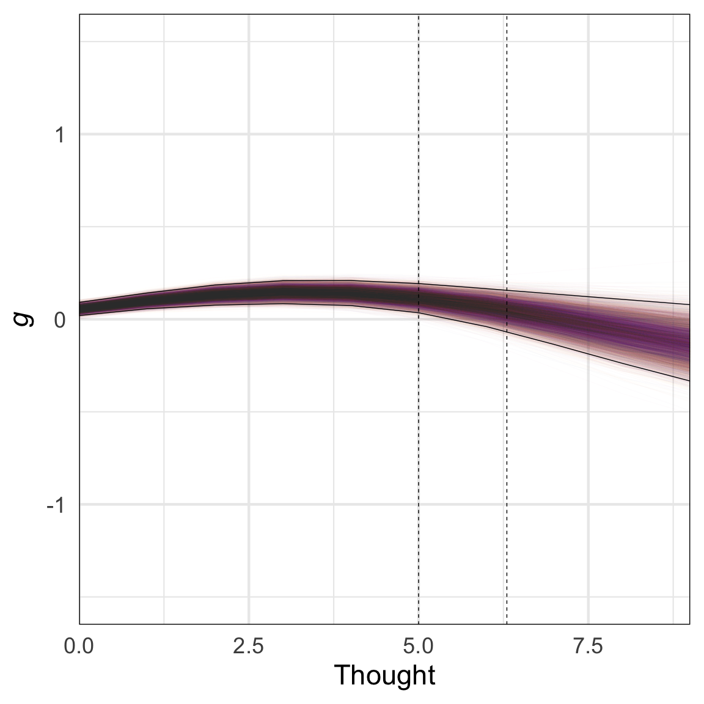<!-- -->

``` r
plot_bootstraps(WitFits,16,"Withdrawn Depression",MaxWit,WitBc,WitC)
```

    ## Warning: Returning more (or less) than 1 row per `summarise()` group was deprecated in
    ## dplyr 1.1.0.
    ## ℹ Please use `reframe()` instead.
    ## ℹ When switching from `summarise()` to `reframe()`, remember that `reframe()`
    ##   always returns an ungrouped data frame and adjust accordingly.
    ## Call `lifecycle::last_lifecycle_warnings()` to see where this warning was
    ## generated.

    ## Warning: Removed 80016 rows containing missing values (`geom_line()`).

<!-- -->

``` r
plot_bootstraps(SocFits,17,'Social',MaxSoc,SocBc,SocC)
```

    ## Warning: Returning more (or less) than 1 row per `summarise()` group was deprecated in
    ## dplyr 1.1.0.
    ## ℹ Please use `reframe()` instead.
    ## ℹ When switching from `summarise()` to `reframe()`, remember that `reframe()`
    ##   always returns an ungrouped data frame and adjust accordingly.
    ## Call `lifecycle::last_lifecycle_warnings()` to see where this warning was
    ## generated.

    ## Warning: Removed 70014 rows containing missing values (`geom_line()`).

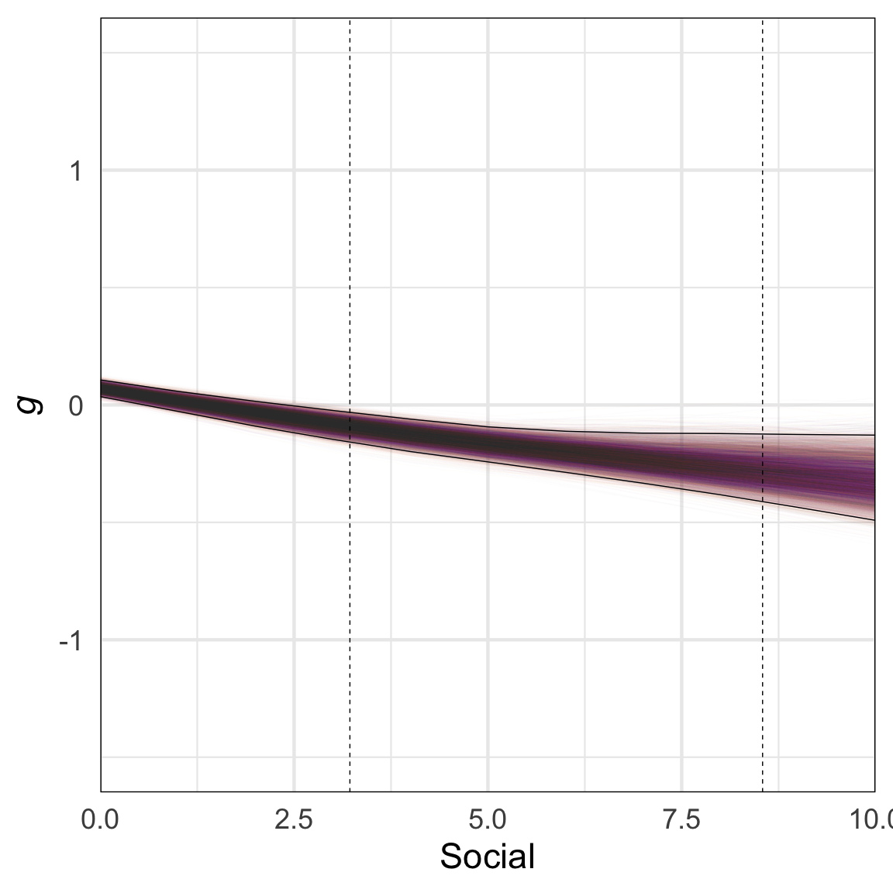<!-- -->

``` r
###
# re-run with MaxAtt instead
###
plot_bootstraps(AttFits,19,'Attention',MaxAtt,AttBc,AttC)
```

    ## Warning: Returning more (or less) than 1 row per `summarise()` group was deprecated in
    ## dplyr 1.1.0.
    ## ℹ Please use `reframe()` instead.
    ## ℹ When switching from `summarise()` to `reframe()`, remember that `reframe()`
    ##   always returns an ungrouped data frame and adjust accordingly.
    ## Call `lifecycle::last_lifecycle_warnings()` to see where this warning was
    ## generated.

    ## Warning: Removed 50010 rows containing missing values (`geom_line()`).

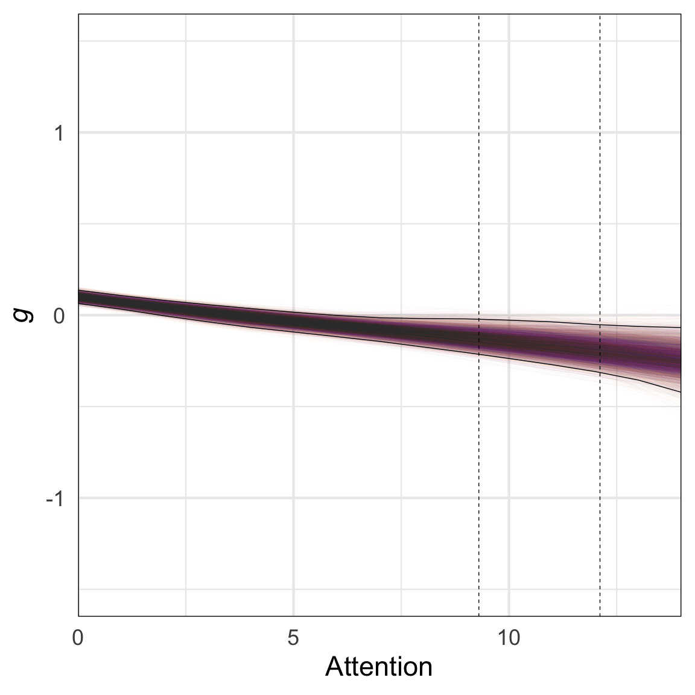<!-- -->

``` r
plot_bootstraps(RulFits,18,'Rule Breaking',MaxRul,RulBc,RulC)
```

    ## Warning: Returning more (or less) than 1 row per `summarise()` group was deprecated in
    ## dplyr 1.1.0.
    ## ℹ Please use `reframe()` instead.
    ## ℹ When switching from `summarise()` to `reframe()`, remember that `reframe()`
    ##   always returns an ungrouped data frame and adjust accordingly.
    ## Call `lifecycle::last_lifecycle_warnings()` to see where this warning was
    ## generated.

    ## Warning: Removed 100020 rows containing missing values (`geom_line()`).

    ## Warning: Removed 1 rows containing missing values (`geom_vline()`).

<!-- -->

``` r
plot_bootstraps(AggFits,32,'Aggression',MaxAgg,AggBc,AggC)
```

    ## Warning: Returning more (or less) than 1 row per `summarise()` group was deprecated in
    ## dplyr 1.1.0.
    ## ℹ Please use `reframe()` instead.
    ## ℹ When switching from `summarise()` to `reframe()`, remember that `reframe()`
    ##   always returns an ungrouped data frame and adjust accordingly.
    ## Call `lifecycle::last_lifecycle_warnings()` to see where this warning was
    ## generated.

    ## Warning: Removed 140028 rows containing missing values (`geom_line()`).

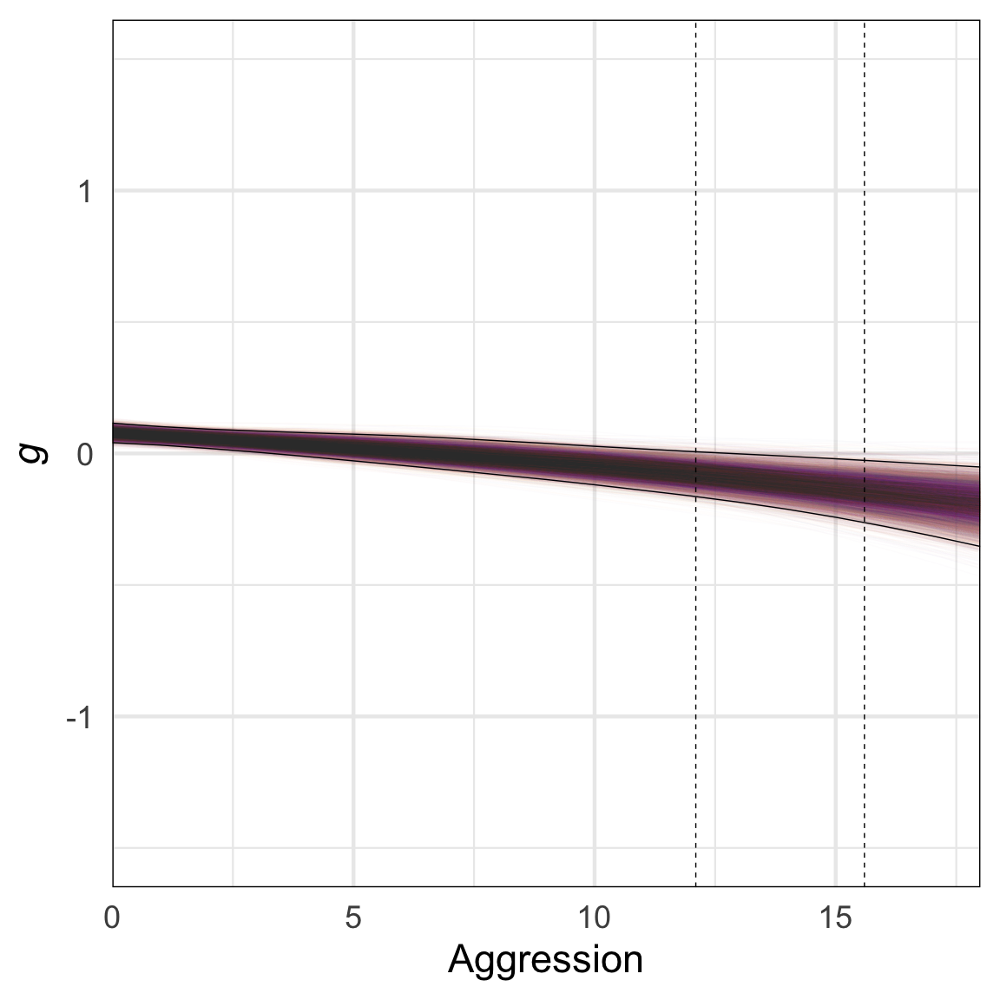<!-- -->

``` r
# calculate derivatives

# p-factor
P_derivative_matrix <- matrix(0, nrow = nrow(PFits), ncol = ncol(PFits) - 1)
# Calculate the derivative for each column
for (i in 1:(ncol(PFits) - 1)) {
  # Calculate the differences in x (assuming a constant difference)
  dx <- 1
  # Calculate the differences in y (predicted values)
  dy <- PFits[, i + 1] - PFits[, i]
  # Calculate the derivatives (slopes)
  derivatives <- dy / dx
  # Store the derivatives in the derivative matrix
  P_derivative_matrix[, i] <- derivatives
}
# calc sig dervs
# get straightfoward of segment where 99% is over 0 or under
positive_counts <- colSums(P_derivative_matrix > 0, na.rm = TRUE)
negative_counts <- colSums(P_derivative_matrix < 0, na.rm = TRUE)
# find where each is 99% or greater
positive_countsSig=positive_counts>9500
negative_countsSig=negative_counts>9500
# make dataframe: 50th percentile of derivatives accompanied by posSig and NegSig vector
data <- apply(P_derivative_matrix, 2, function(x) quantile(x, probs = 0.5))
dervPlotDf<-data.frame(data,positive_countsSig,negative_countsSig)
# if either is sig at 99% plot
dervPlotDf$sig_derivMask=dervPlotDf[,2]+dervPlotDf[,3]>0
# use it to mask calculated derivs
dervPlotDf$sig_deriv=0
dervPlotDf$sig_deriv[dervPlotDf$sig_derivMask]=dervPlotDf$data[dervPlotDf$sig_derivMask]
dervPlotDf$seq=1:(dim(dervPlotDf)[1])
ggplot(data=dervPlotDf) + geom_raster(aes(x = seq, y = .5, fill = sig_deriv))+
    theme(panel.spacing = unit(-.01,"cm")) +
    scale_fill_gradientn(colors = my_palette(100),limits = c(min(-.1),max(0.1)))+theme_minimal(base_size = 35)+
    xlim(c(0,MaxP))+xlab(expression(italic('p')))+
    guides(fill=FALSE)+
    theme(axis.title.y = element_blank(),axis.text.y=element_blank())+theme(panel.border = element_rect(color = "black", fill = NA, size = 1))+
    scale_x_continuous(limits = c(0,MaxP),expand = expansion(mult = c(0, 0)))
```

    ## Warning: The `<scale>` argument of `guides()` cannot be `FALSE`. Use "none" instead as
    ## of ggplot2 3.3.4.
    ## This warning is displayed once every 8 hours.
    ## Call `lifecycle::last_lifecycle_warnings()` to see where this warning was
    ## generated.

    ## Scale for x is already present.
    ## Adding another scale for x, which will replace the existing scale.

    ## Warning: Removed 49 rows containing missing values (`geom_raster()`).

<!-- -->

``` r
########################

# Internalizing
Int_derivative_matrix <- matrix(0, nrow = nrow(IFits), ncol = ncol(IFits) - 1)
# Calculate the derivative for each column
for (i in 1:(ncol(IFits) - 1)) {
  # Calculate the differences in x (assuming a constant difference)
  dx <- 1
  # Calculate the differences in y (predicted values)
  dy <- IFits[, i + 1] - IFits[, i]
  # Calculate the derivatives (slopes)
  derivatives <- dy / dx
  # Store the derivatives in the derivative matrix
  Int_derivative_matrix[, i] <- derivatives
}
# calc sig dervs
# get straightfoward of segment where 99% is over 0 or under
positive_counts <- colSums(Int_derivative_matrix > 0, na.rm = TRUE)
negative_counts <- colSums(Int_derivative_matrix < 0, na.rm = TRUE)
# find where each is 99% or greater
positive_countsSig=positive_counts>9500
negative_countsSig=negative_counts>9500
# make dataframe: 50th percentile of derivatives accompanied by posSig and NegSig vector
data <- apply(Int_derivative_matrix, 2, function(x) quantile(x, probs = 0.5))
dervPlotDf<-data.frame(data,positive_countsSig,negative_countsSig)
# if either is sig at 99% plot
dervPlotDf$sig_derivMask=dervPlotDf[,2]+dervPlotDf[,3]>0
# use it to mask calculated derivs
dervPlotDf$sig_deriv=0
dervPlotDf$sig_deriv[dervPlotDf$sig_derivMask]=dervPlotDf$data[dervPlotDf$sig_derivMask]
dervPlotDf$seq=1:(dim(dervPlotDf)[1])
ggplot(data=dervPlotDf) + geom_raster(aes(x = seq, y = .5, fill = sig_deriv))+
    theme(panel.spacing = unit(-.01,"cm")) +
    scale_fill_gradientn(colors = my_palette(100),limits = c(min(-.1),max(0.1)))+theme_minimal(base_size = 35)+
    xlim(c(0,MaxI))+xlab('Internalizing')+
    guides(fill=FALSE)+
    theme(axis.title.y = element_blank(),axis.text.y=element_blank())+theme(panel.border = element_rect(color = "black", fill = NA, size = 1))+
    scale_x_continuous(limits = c(0,MaxI),expand = expansion(mult = c(0, 0)))
```

    ## Scale for x is already present.
    ## Adding another scale for x, which will replace the existing scale.

    ## Warning: Removed 27 rows containing missing values (`geom_raster()`).

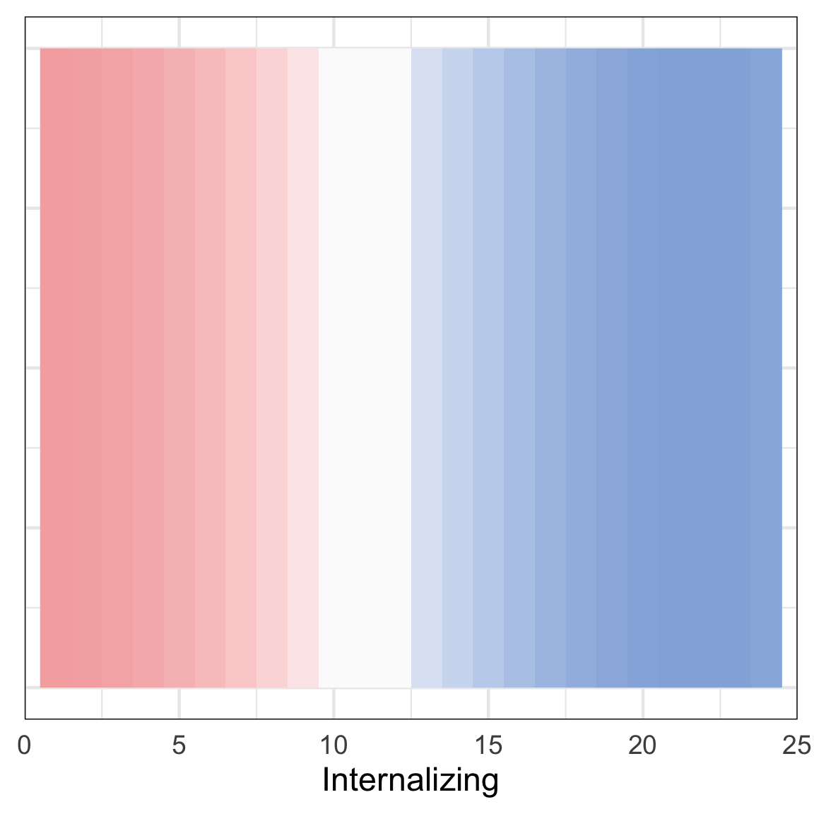<!-- -->

``` r
########################

# Externalizing
Ext_derivative_matrix <- matrix(0, nrow = nrow(EFits), ncol = ncol(EFits) - 1)
# Calculate the derivative for each column
for (i in 1:(ncol(EFits) - 1)) {
  # Calculate the differences in x (assuming a constant difference)
  dx <- 1
  # Calculate the differences in y (predicted values)
  dy <- EFits[, i + 1] - EFits[, i]
  # Calculate the derivatives (slopes)
  derivatives <- dy / dx
  # Store the derivatives in the derivative matrix
  Ext_derivative_matrix[, i] <- derivatives
}
# calc sig dervs
# get straightfoward of segment where 99% is over 0 or under
positive_counts <- colSums(Ext_derivative_matrix > 0, na.rm = TRUE)
negative_counts <- colSums(Ext_derivative_matrix < 0, na.rm = TRUE)
# find where each is 99% or greater
positive_countsSig=positive_counts>9500
negative_countsSig=negative_counts>9500
# make dataframe: 50th percentile of derivatives accompanied by posSig and NegSig vector
data <- apply(Ext_derivative_matrix, 2, function(x) quantile(x, probs = 0.5))
dervPlotDf<-data.frame(data,positive_countsSig,negative_countsSig)
# if either is sig at 99% plot
dervPlotDf$sig_derivMask=dervPlotDf[,2]+dervPlotDf[,3]>0
# use it to mask calculated derivs
dervPlotDf$sig_deriv=0
dervPlotDf$sig_deriv[dervPlotDf$sig_derivMask]=dervPlotDf$data[dervPlotDf$sig_derivMask]
dervPlotDf$seq=1:(dim(dervPlotDf)[1])
ggplot(data=dervPlotDf) + geom_raster(aes(x = seq, y = .5, fill = sig_deriv))+
    theme(panel.spacing = unit(-.01,"cm")) +
    scale_fill_gradientn(colors = my_palette(100),limits = c(min(-.1),max(0.1)))+theme_minimal(base_size = 35)+
    xlim(c(0,MaxE))+xlab('Externalizing')+
    guides(fill=FALSE)+
    theme(axis.title.y = element_blank(),axis.text.y=element_blank())+theme(panel.border = element_rect(color = "black", fill = NA, size = 1))+
    scale_x_continuous(limits = c(0,MaxE),expand = expansion(mult = c(0, 0)))
```

    ## Scale for x is already present.
    ## Adding another scale for x, which will replace the existing scale.

    ## Warning: Removed 23 rows containing missing values (`geom_raster()`).

<!-- -->

``` r
########################

# Somatic
Som_derivative_matrix <- matrix(0, nrow = nrow(SomFits), ncol = ncol(SomFits) - 1)
# Calculate the derivative for each column
for (i in 1:(ncol(SomFits) - 1)) {
  # Calculate the differences in x (assuming a constant difference)
  dx <- 1
  # Calculate the differences in y (predicted values)
  dy <- SomFits[, i + 1] - SomFits[, i]
  # Calculate the derivatives (slopes)
  derivatives <- dy / dx
  # Store the derivatives in the derivative matrix
  Som_derivative_matrix[, i] <- derivatives
}
# calc sig dervs
# get straightfoward of segment where 99% is over 0 or under
positive_counts <- colSums(Som_derivative_matrix > 0, na.rm = TRUE)
negative_counts <- colSums(Som_derivative_matrix < 0, na.rm = TRUE)
# find where each is 99% or greater
positive_countsSig=positive_counts>9500
negative_countsSig=negative_counts>9500
# make dataframe: 50th percentile of derivatives accompanied by posSig and NegSig vector
data <- apply(Som_derivative_matrix, 2, function(x) quantile(x, probs = 0.5))
dervPlotDf<-data.frame(data,positive_countsSig,negative_countsSig)
# if either is sig at 99% plot
dervPlotDf$sig_derivMask=dervPlotDf[,2]+dervPlotDf[,3]>0
# use it to mask calculated derivs
dervPlotDf$sig_deriv=0
dervPlotDf$sig_deriv[dervPlotDf$sig_derivMask]=dervPlotDf$data[dervPlotDf$sig_derivMask]
dervPlotDf$seq=1:(dim(dervPlotDf)[1])
ggplot(data=dervPlotDf) + geom_raster(aes(x = seq, y = .5, fill = sig_deriv))+
    theme(panel.spacing = unit(-.01,"cm")) +
    scale_fill_gradientn(colors = my_palette(100),limits = c(min(-.1),max(0.1)))+theme_minimal(base_size = 35)+
    xlim(c(0,MaxSom))+xlab('Somatic')+
    guides(fill=FALSE)+
    theme(axis.title.y = element_blank(),axis.text.y=element_blank())+theme(panel.border = element_rect(color = "black", fill = NA, size = 1))+
    scale_x_continuous(limits = c(0,MaxSom),expand = expansion(mult = c(0, 0)))
```

    ## Scale for x is already present.
    ## Adding another scale for x, which will replace the existing scale.

    ## Warning: Removed 6 rows containing missing values (`geom_raster()`).

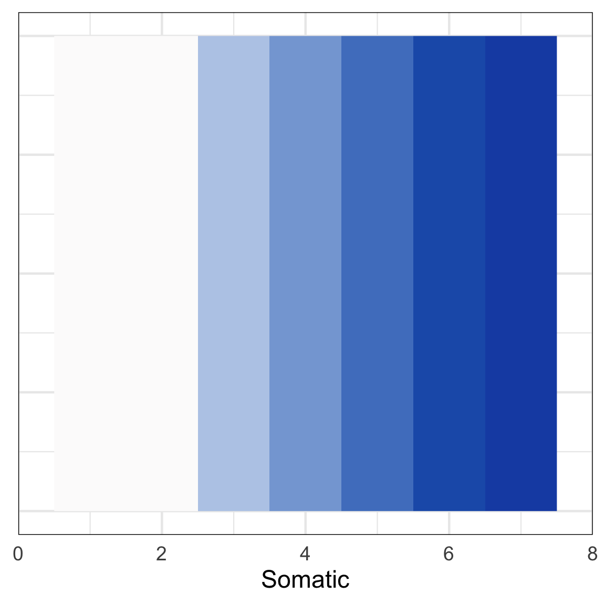<!-- -->

``` r
########################

# AnxDep
AnxDep_derivative_matrix <- matrix(0, nrow = nrow(AnxFits), ncol = ncol(AnxFits) - 1)
# Calculate the derivative for each column
for (i in 1:(ncol(AnxFits) - 1)) {
  # Calculate the differences in x (assuming a constant difference)
  dx <- 1
  # Calculate the differences in y (predicted values)
  dy <- AnxFits[, i + 1] - AnxFits[, i]
  # Calculate the derivatives (slopes)
  derivatives <- dy / dx
  # Store the derivatives in the derivative matrix
  AnxDep_derivative_matrix[, i] <- derivatives
}
# calc sig dervs
# get straightfoward of segment where 99% is over 0 or under
positive_counts <- colSums(AnxDep_derivative_matrix > 0, na.rm = TRUE)
negative_counts <- colSums(AnxDep_derivative_matrix < 0, na.rm = TRUE)
# find where each is 99% or greater
positive_countsSig=positive_counts>9500
negative_countsSig=negative_counts>9500
# make dataframe: 50th percentile of derivatives accompanied by posSig and NegSig vector
data <- apply(AnxDep_derivative_matrix, 2, function(x) quantile(x, probs = 0.5))
dervPlotDf<-data.frame(data,positive_countsSig,negative_countsSig)
# if either is sig at 99% plot
dervPlotDf$sig_derivMask=dervPlotDf[,2]+dervPlotDf[,3]>0
# use it to mask calculated derivs
dervPlotDf$sig_deriv=0
dervPlotDf$sig_deriv[dervPlotDf$sig_derivMask]=dervPlotDf$data[dervPlotDf$sig_derivMask]
dervPlotDf$seq=1:(dim(dervPlotDf)[1])
ggplot(data=dervPlotDf) + geom_raster(aes(x = seq, y = .5, fill = sig_deriv))+
    theme(panel.spacing = unit(-.01,"cm")) +
    scale_fill_gradientn(colors = my_palette(100),limits = c(min(-.1),max(0.1)))+theme_minimal(base_size = 35)+
    xlim(c(0,MaxAnx))+xlab('Anxious Depression')+
    guides(fill=FALSE)+
    theme(axis.title.y = element_blank(),axis.text.y=element_blank())+theme(panel.border = element_rect(color = "black", fill = NA, size = 1))+
    scale_x_continuous(limits = c(0,MaxAnx),expand = expansion(mult = c(0, 0)))
```

    ## Scale for x is already present.
    ## Adding another scale for x, which will replace the existing scale.

    ## Warning: Removed 13 rows containing missing values (`geom_raster()`).

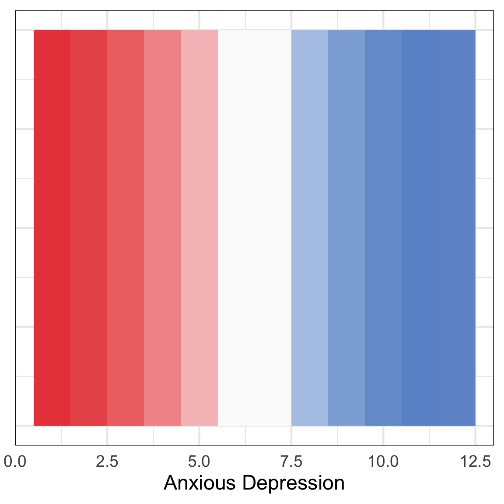<!-- -->

``` r
########################

# Thought
Thought_derivative_matrix <- matrix(0, nrow = nrow(ThoFits), ncol = ncol(ThoFits) - 1)
# Calculate the derivative for each column
for (i in 1:(ncol(ThoFits) - 1)) {
  # Calculate the differences in x (assuming a constant difference)
  dx <- 1
  # Calculate the differences in y (predicted values)
  dy <- ThoFits[, i + 1] - ThoFits[, i]
  # Calculate the derivatives (slopes)
  derivatives <- dy / dx
  # Store the derivatives in the derivative matrix
  Thought_derivative_matrix[, i] <- derivatives
}
# calc sig dervs
# get straightfoward of segment where 99% is over 0 or under
positive_counts <- colSums(Thought_derivative_matrix > 0, na.rm = TRUE)
negative_counts <- colSums(Thought_derivative_matrix < 0, na.rm = TRUE)
# find where each is 99% or greater
positive_countsSig=positive_counts>9500
negative_countsSig=negative_counts>9500
# make dataframe: 50th percentile of derivatives accompanied by posSig and NegSig vector
data <- apply(Thought_derivative_matrix, 2, function(x) quantile(x, probs = 0.5))
dervPlotDf<-data.frame(data,positive_countsSig,negative_countsSig)
# if either is sig at 99% plot
dervPlotDf$sig_derivMask=dervPlotDf[,2]+dervPlotDf[,3]>0
# use it to mask calculated derivs
dervPlotDf$sig_deriv=0
dervPlotDf$sig_deriv[dervPlotDf$sig_derivMask]=dervPlotDf$data[dervPlotDf$sig_derivMask]
dervPlotDf$seq=1:(dim(dervPlotDf)[1])
ggplot(data=dervPlotDf) + geom_raster(aes(x = seq, y = .5, fill = sig_deriv))+
    theme(panel.spacing = unit(-.01,"cm")) +
    scale_fill_gradientn(colors = my_palette(100),limits = c(min(-.1),max(0.1)))+theme_minimal(base_size = 35)+
    xlim(c(0,MaxTho))+xlab('Thought')+
    guides(fill=FALSE)+
    theme(axis.title.y = element_blank(),axis.text.y=element_blank())+theme(panel.border = element_rect(color = "black", fill = NA, size = 1))+
    scale_x_continuous(limits = c(0,MaxTho),expand = expansion(mult = c(0, 0)))
```

    ## Scale for x is already present.
    ## Adding another scale for x, which will replace the existing scale.

    ## Warning: Removed 10 rows containing missing values (`geom_raster()`).

<!-- -->

``` r
########################

# Withdrawn depression
WithDep_derivative_matrix <- matrix(0, nrow = nrow(WitFits), ncol = ncol(WitFits) - 1)
# Calculate the derivative for each column
for (i in 1:(ncol(WitFits) - 1)) {
  # Calculate the differences in x (assuming a constant difference)
  dx <- 1
  # Calculate the differences in y (predicted values)
  dy <- WitFits[, i + 1] - WitFits[, i]
  # Calculate the derivatives (slopes)
  derivatives <- dy / dx
  # Store the derivatives in the derivative matrix
  WithDep_derivative_matrix[, i] <- derivatives
}
# calc sig dervs
# get straightfoward of segment where 99% is over 0 or under
positive_counts <- colSums(WithDep_derivative_matrix > 0, na.rm = TRUE)
negative_counts <- colSums(WithDep_derivative_matrix < 0, na.rm = TRUE)
# find where each is 99% or greater
positive_countsSig=positive_counts>9500
negative_countsSig=negative_counts>9500
# make dataframe: 50th percentile of derivatives accompanied by posSig and NegSig vector
data <- apply(WithDep_derivative_matrix, 2, function(x) quantile(x, probs = 0.5))
dervPlotDf<-data.frame(data,positive_countsSig,negative_countsSig)
dervPlotDf$sig_derivMask=dervPlotDf[,2]+dervPlotDf[,3]>0
dervPlotDf$sig_deriv=0
dervPlotDf$sig_deriv[dervPlotDf$sig_derivMask]=dervPlotDf$data[dervPlotDf$sig_derivMask]
dervPlotDf$seq=1:(dim(dervPlotDf)[1])
ggplot(data=dervPlotDf) + geom_raster(aes(x = seq, y = .5, fill = sig_deriv))+
      theme(panel.spacing = unit(-.01,"cm")) +
      scale_fill_gradientn(colors = my_palette(100),limits = c(min(-.1),max(0.1)))+theme_minimal(base_size = 35)+xlim(c(0,MaxWit))+xlab('Withdrawn Depression')+
      guides(fill=FALSE)+
      theme(axis.title.y = element_blank(),axis.text.y=element_blank())+theme(panel.border = element_rect(color = "black", fill = NA, size = 1))+
      scale_x_continuous(limits = c(0,MaxWit),expand = expansion(mult = c(0, 0)),breaks = seq(0, MaxWit, by = 2))
```

    ## Scale for x is already present.
    ## Adding another scale for x, which will replace the existing scale.

    ## Warning: Removed 9 rows containing missing values (`geom_raster()`).

<!-- -->

``` r
# Social
Soc_derivative_matrix <- matrix(0, nrow = nrow(SocFits), ncol = ncol(SocFits) - 1)
# Calculate the derivative for each column
for (i in 1:(ncol(SocFits) - 1)) {
  # Calculate the differences in x (assuming a constant difference)
  dx <- 1
  # Calculate the differences in y (predicted values)
  dy <- SocFits[, i + 1] - SocFits[, i]
  # Calculate the derivatives (slopes)
  derivatives <- dy / dx
  # Store the derivatives in the derivative matrix
  Soc_derivative_matrix[, i] <- derivatives
}
# calc sig dervs
# get straightfoward of segment where 99% is over 0 or under
positive_counts <- colSums(Soc_derivative_matrix > 0, na.rm = TRUE)
negative_counts <- colSums(Soc_derivative_matrix < 0, na.rm = TRUE)
# find where each is 99% or greater
positive_countsSig=positive_counts>9500
negative_countsSig=negative_counts>9500
# make dataframe: 50th percentile of derivatives accompanied by posSig and NegSig vector
data <- apply(Soc_derivative_matrix, 2, function(x) quantile(x, probs = 0.5))
dervPlotDf<-data.frame(data,positive_countsSig,negative_countsSig)
dervPlotDf$sig_derivMask=dervPlotDf[,2]+dervPlotDf[,3]>0
dervPlotDf$sig_deriv=0
dervPlotDf$sig_deriv[dervPlotDf$sig_derivMask]=dervPlotDf$data[dervPlotDf$sig_derivMask]
dervPlotDf$seq=1:(dim(dervPlotDf)[1])
ggplot(data=dervPlotDf) + geom_raster(aes(x = seq, y = .5, fill = sig_deriv))+
      theme(panel.spacing = unit(-.01,"cm")) +
      scale_fill_gradientn(colors = my_palette(100),limits = c(min(-.1),max(0.1)))+theme_minimal(base_size = 35)+xlim(c(0,MaxSoc))+xlab('Social')+
      guides(fill=FALSE)+
      theme(axis.title.y = element_blank(),axis.text.y=element_blank())+theme(panel.border = element_rect(color = "black", fill = NA, size = 1))+
      scale_x_continuous(breaks=c(0,3,6,9,12),limits = c(0,MaxSoc),expand = expansion(mult = c(0, 0)))
```

    ## Scale for x is already present.
    ## Adding another scale for x, which will replace the existing scale.

    ## Warning: Removed 8 rows containing missing values (`geom_raster()`).

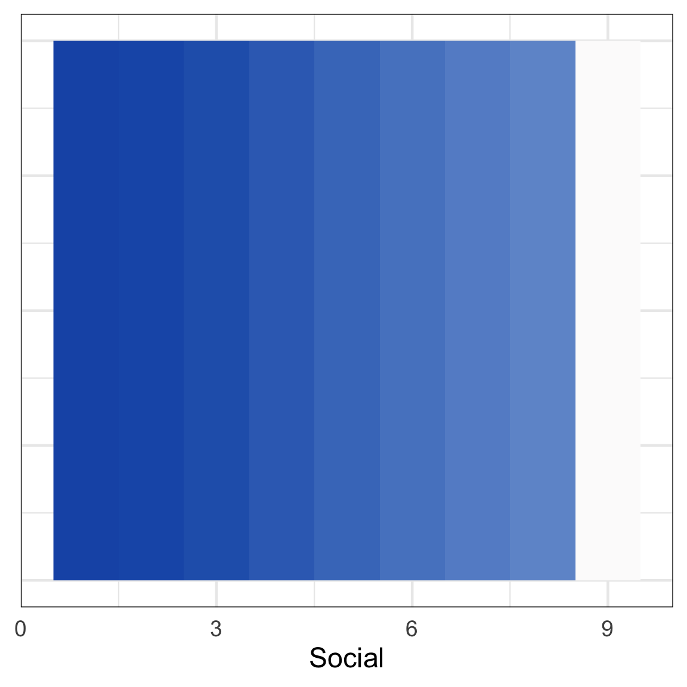<!-- -->

``` r
########################

# Attention
Att_derivative_matrix <- matrix(0, nrow = nrow(AttFits), ncol = ncol(AttFits) - 1)
# Calculate the derivative for each column
for (i in 1:(ncol(AttFits) - 1)) {
  # Calculate the differences in x (assuming a constant difference)
  dx <- 1
  # Calculate the differences in y (predicted values)
  dy <- AttFits[, i + 1] - AttFits[, i]
  # Calculate the derivatives (slopes)
  derivatives <- dy / dx
  # Store the derivatives in the derivative matrix
  Att_derivative_matrix[, i] <- derivatives
}
# calc sig dervs
# get straightfoward of segment where 99% is over 0 or under
positive_counts <- colSums(Att_derivative_matrix > 0, na.rm = TRUE)
negative_counts <- colSums(Att_derivative_matrix < 0, na.rm = TRUE)
# find where each is 99% or greater
positive_countsSig=positive_counts>9500
negative_countsSig=negative_counts>9500
data <- apply(Att_derivative_matrix, 2, function(x) quantile(x, probs = 0.5))
dervPlotDf<-data.frame(data,positive_countsSig,negative_countsSig)
dervPlotDf$sig_derivMask=dervPlotDf[,2]+dervPlotDf[,3]>0
dervPlotDf$sig_deriv=0
dervPlotDf$sig_deriv[dervPlotDf$sig_derivMask]=dervPlotDf$data[dervPlotDf$sig_derivMask]
dervPlotDf$seq=1:(dim(dervPlotDf)[1])
ggplot(data=dervPlotDf) + geom_raster(aes(x = seq, y = .5, fill = sig_deriv))+
      theme(panel.spacing = unit(-.01,"cm")) +
      scale_fill_gradientn(colors = my_palette(100),limits = c(min(-.1),max(0.1)))+theme_minimal(base_size = 35)+xlim(c(0,MaxAtt))+xlab('Attention')+
      guides(fill=FALSE)+
      theme(axis.title.y = element_blank(),axis.text.y=element_blank())+theme(panel.border = element_rect(color = "black", fill = NA, size = 1))+
      scale_x_continuous(limits = c(0,MaxAtt),expand = expansion(mult = c(0, 0)))
```

    ## Scale for x is already present.
    ## Adding another scale for x, which will replace the existing scale.

    ## Warning: Removed 6 rows containing missing values (`geom_raster()`).

<!-- -->

``` r
########################

# for Rul
Rul_derivative_matrix <- matrix(0, nrow = nrow(RulFits), ncol = ncol(RulFits) - 1)
# Calculate the derivative for each column
for (i in 1:(ncol(RulFits) - 1)) {
  # Calculate the differences in x (assuming a constant difference)
  dx <- 1
  # Calculate the differences in y (predicted values)
  dy <- RulFits[, i + 1] - RulFits[, i]
  # Calculate the derivatives (slopes)
  derivatives <- dy / dx
  # Store the derivatives in the derivative matrix
  Rul_derivative_matrix[, i] <- derivatives
}
# calc sig dervs
# get straightfoward of segment where 99% is over 0 or under
positive_counts <- colSums(Rul_derivative_matrix > 0, na.rm = TRUE)
negative_counts <- colSums(Rul_derivative_matrix < 0, na.rm = TRUE)
# find where each is 99% or greater
positive_countsSig=positive_counts>9500
negative_countsSig=negative_counts>9500
data <- apply(Rul_derivative_matrix, 2, function(x) quantile(x, probs = 0.5))
dervPlotDf<-data.frame(data,positive_countsSig,negative_countsSig)
dervPlotDf$sig_derivMask=dervPlotDf[,2]+dervPlotDf[,3]>0
dervPlotDf$sig_deriv=0
dervPlotDf$sig_deriv[dervPlotDf$sig_derivMask]=dervPlotDf$data[dervPlotDf$sig_derivMask]
dervPlotDf$seq=1:(dim(dervPlotDf)[1])
ggplot(data=dervPlotDf) + geom_raster(aes(x = seq, y = .5, fill = sig_deriv))+
      theme(panel.spacing = unit(-.01,"cm")) +
      scale_fill_gradientn(colors = my_palette(100),limits = c(min(-.1),max(0.1)))+theme_minimal(base_size = 35)+xlim(c(0,MaxRul))+xlab('Rule Breaking')+
      guides(fill=FALSE)+
      theme(axis.title.y = element_blank(),axis.text.y=element_blank())+theme(panel.border = element_rect(color = "black", fill = NA, size = 1))+
      scale_x_continuous(breaks=c(0,3,6,9,12),limits = c(0,MaxRul),expand = expansion(mult = c(0, 0)))
```

    ## Scale for x is already present.
    ## Adding another scale for x, which will replace the existing scale.

    ## Warning: Removed 11 rows containing missing values (`geom_raster()`).

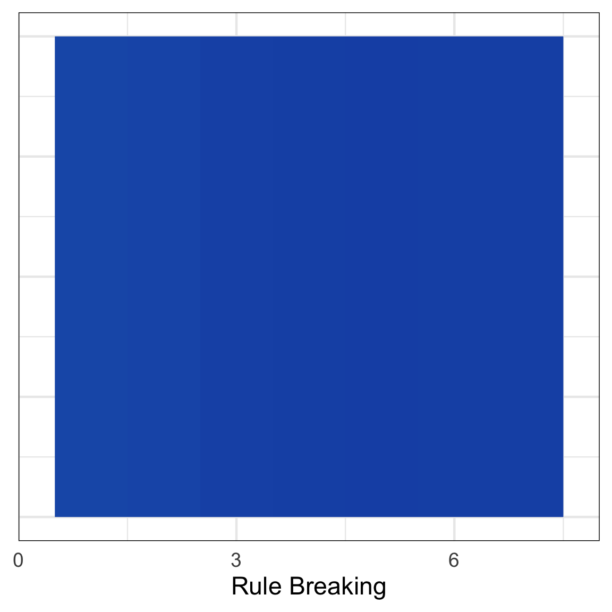<!-- -->

``` r
########################

# Aggression
Agg_derivative_matrix <- matrix(0, nrow = nrow(AggFits), ncol = ncol(AggFits) - 1)
# Calculate the derivative for each column
for (i in 1:(ncol(AggFits) - 1)) {
  # Calculate the differences in x (assuming a constant difference)
  dx <- 1
  # Calculate the differences in y (predicted values)
  dy <- AggFits[, i + 1] - AggFits[, i]
  # Calculate the derivatives (slopes)
  derivatives <- dy / dx
  # Store the derivatives in the derivative matrix
  Agg_derivative_matrix[, i] <- derivatives
}
# calc sig dervs
# get straightfoward of segment where 99% is over 0 or under
positive_counts <- colSums(Agg_derivative_matrix > 0, na.rm = TRUE)
negative_counts <- colSums(Agg_derivative_matrix < 0, na.rm = TRUE)
# find where each is 99% or greater
positive_countsSig=positive_counts>9500
negative_countsSig=negative_counts>9500
data <- apply(Agg_derivative_matrix, 2, function(x) quantile(x, probs = 0.5))

dervPlotDf<-data.frame(data,positive_countsSig,negative_countsSig)
dervPlotDf$sig_derivMask=dervPlotDf[,2]+dervPlotDf[,3]>0
dervPlotDf$sig_deriv=0
dervPlotDf$sig_deriv[dervPlotDf$sig_derivMask]=dervPlotDf$data[dervPlotDf$sig_derivMask]
dervPlotDf$seq=1:(dim(dervPlotDf)[1])
ggplot(data=dervPlotDf) + geom_raster(aes(x = seq, y = .5, fill = sig_deriv))+
      theme(panel.spacing = unit(-.01,"cm")) +
      scale_fill_gradientn(colors = my_palette(100),limits = c(min(-.1),max(0.1)))+theme_minimal(base_size = 35)+xlim(c(0,MaxAgg))+xlab('Aggression')+
      guides(fill=FALSE)+
      theme(axis.title.y = element_blank(),axis.text.y=element_blank())+theme(panel.border = element_rect(color = "black", fill = NA, size = 1))+
      scale_x_continuous(limits = c(0,MaxAgg),expand = expansion(mult = c(0, 0)))
```

    ## Scale for x is already present.
    ## Adding another scale for x, which will replace the existing scale.

    ## Warning: Removed 15 rows containing missing values (`geom_raster()`).

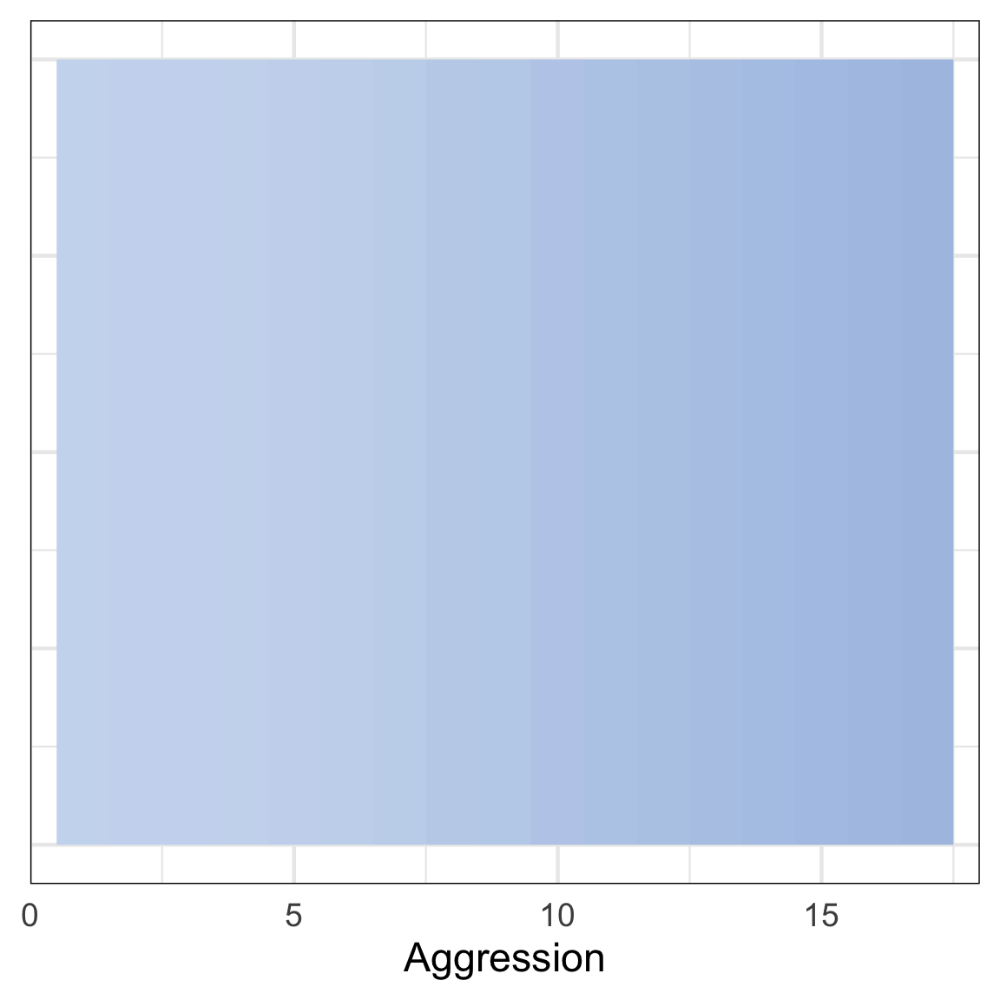<!-- -->

``` r
# proof-of-concept g~p linear in healthy and clinical range
masterdf=readRDS('~/gp_masterdf.rds')
healthy=masterdf[masterdf$cbcl_scr_syn_totprob_r<Pbc,]
clin=masterdf[masterdf$cbcl_scr_syn_totprob_r>Pc,]
# reference linear model
plotdf<-data.frame(clin$parentPcount,clin$g,clin$cbcl_scr_syn_totprob_r,clin$interview_age)
colnames(plotdf)<-c('parentPcount','g','cbcl_scr_syn_totprob_r','interview_age')
modelforresids<-gam(g~s(interview_age),data=plotdf)
plotdf$resids<-modelforresids$residuals

ggplot(data = plotdf,aes(x = cbcl_scr_syn_totprob_r, y = resids)) + geom_hex(bins=20)+
    geom_point(alpha=0)+
    geom_smooth(method = "lm",formula = y~x,color='gray') +
    scale_fill_viridis_c(option = "inferno") +
    theme_minimal(base_size=35) + 
    ylab(expression(italic(g)))+xlab(expression(italic(p)))+
    geom_vline(xintercept = Pc, linetype = "dashed")+
    theme(legend.position = "bottom",panel.border = element_rect(color = "black", fill = NA, size = 1),legend.margin = margin(-25, 0, 0, 0, "pt"),legend.key.width = unit(2.5,"cm"))+
    scale_x_continuous(limits = c(Pc,MaxP),expand = expansion(mult = c(0, 0)))
```

    ## Warning: Removed 90 rows containing non-finite values (`stat_binhex()`).

    ## Warning: Removed 90 rows containing non-finite values (`stat_smooth()`).

    ## Warning: Removed 3 rows containing missing values (`geom_hex()`).

    ## Warning: Removed 90 rows containing missing values (`geom_point()`).

<!-- -->

``` r
# and healthy version
# reference linear model
plotdf<-data.frame(healthy$parentPcount,healthy$g,healthy$cbcl_scr_syn_totprob_r,healthy$interview_age)
colnames(plotdf)<-c('parentPcount','g','cbcl_scr_syn_totprob_r','interview_age')
modelforresids<-gam(g~s(interview_age),data=plotdf)
plotdf$resids<-modelforresids$residuals

ggplot(data = plotdf,aes(x = cbcl_scr_syn_totprob_r, y = resids)) + geom_hex(bins=20)+
    geom_point(alpha=0)+
    geom_smooth(method = "lm",formula = y~x,color='gray') +
    scale_fill_viridis_c(option = "inferno") +
    theme_minimal(base_size=35) + 
    ylab(expression(italic(g)))+xlab(expression(italic(p)))+
    geom_vline(xintercept = Pbc, linetype = "dashed")+
    theme(legend.position = "bottom",panel.border = element_rect(color = "black", fill = NA, size = 1),legend.margin = margin(-25, 0, 0, 0, "pt"),legend.key.width = unit(2.5,"cm"))+
    scale_x_continuous(limits = c(0,Pbc),expand = expansion(mult = c(0, 0)))
```

    ## Warning: Removed 9 rows containing missing values (`geom_hex()`).

<!-- -->
