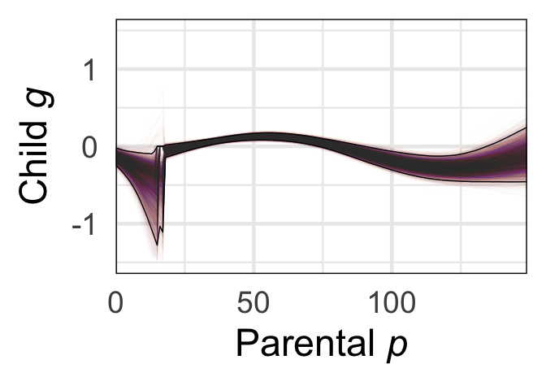
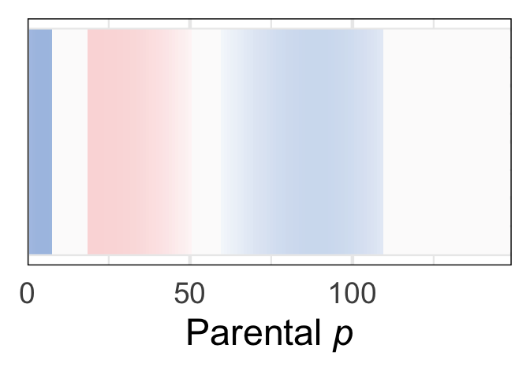
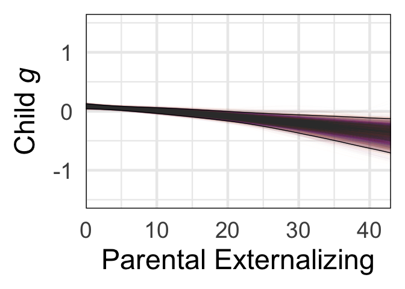
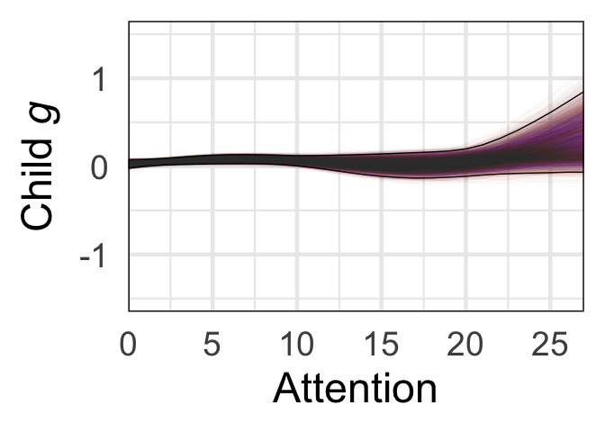
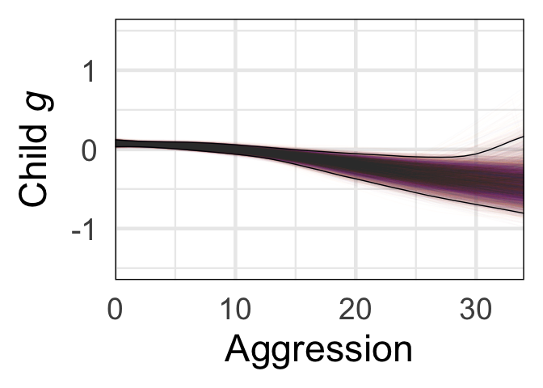
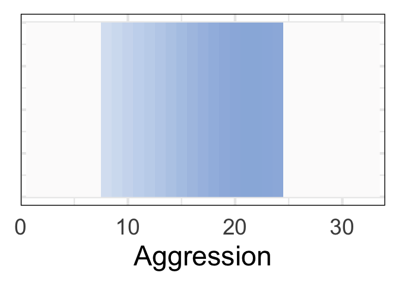
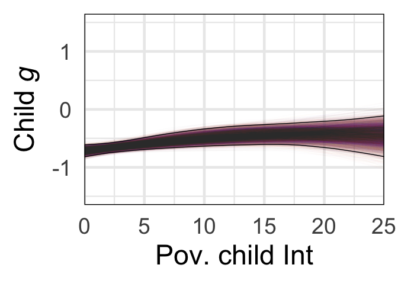
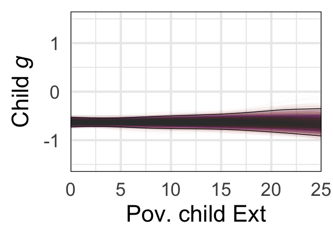

Figure2
================
2023-06-09

``` r
# load libraries
library(ggplot2)
library(hexbin)
library(reshape2)
library(viridis)
```

    ## Loading required package: viridisLite

``` r
library(dplyr)
```

    ## 
    ## Attaching package: 'dplyr'

    ## The following objects are masked from 'package:stats':
    ## 
    ##     filter, lag

    ## The following objects are masked from 'package:base':
    ## 
    ##     intersect, setdiff, setequal, union

``` r
library(mgcv)
```

    ## Loading required package: nlme

    ## 
    ## Attaching package: 'nlme'

    ## The following object is masked from 'package:dplyr':
    ## 
    ##     collapse

    ## This is mgcv 1.8-42. For overview type 'help("mgcv-package")'.

``` r
library(ggExtra)
library(tidyr)
```

    ## 
    ## Attaching package: 'tidyr'

    ## The following object is masked from 'package:reshape2':
    ## 
    ##     smiths

``` r
plot_bootstraps_par <- function(data,maxval,Name,maxValuePlot) {
  # Melt the data frame
  data_melt <- melt(t(data))
  data_melt$Var1 <- rep(seq(0, maxval), nrow(data))

  # Calculate percentiles
  percentiles <- data %>%
    summarise(across(everything(), quantile, probs = c(0.01, 0.99), na.rm = TRUE))
  
  percentiles_long <- tidyr::pivot_longer(percentiles, cols = everything(), names_to = "Percentile", values_to = "YValue")

  # Add CI column
  data_melt$CI <- 0
  
  # Prepare CIs for insertion
  CIs <- data.frame(rep(seq(0, maxval), 2), c(rep(10001, (maxval+1)), rep(10002, (maxval+1))), percentiles_long$YValue, rep(1, ((maxval+1)*2)))
  colnames(CIs) <- colnames(data_melt)
  
  # Add CIs
  data_melt2 <- rbind(data_melt, CIs)
  
  # Convert CI column to factor
  data_melt2$CI <- as.factor(data_melt2$CI)
  
  # Plotting the lines
  ggplot(data = data_melt2, aes(x = Var1, y = value, group = Var2, color = Var2)) +
    geom_line(aes(alpha = CI), show.legend = FALSE) +
    scale_color_viridis_c(option = "inferno", direction = -1) +
    scale_alpha_manual(values = c(0.01, 1), guide = FALSE) + ylim(c(-1.5,1.5)) +
    theme_minimal(base_size=35) + 
    ylab(y_title)+xlab(Name)+
    theme(panel.border = element_rect(color = "black", fill = NA, size = 1))+
    scale_x_continuous(limits = c(0,maxValuePlot),expand = expansion(mult = c(0, 0)))
}
# and and a derivatives version. only change is ylim
plot_bootstrapDerivs <- function(data,maxval,Name,maxValuePlot,BorderlineClinical,Clinical) {
  # Melt the data frame
  data_melt <- melt(t(data))
  data_melt$Var1 <- rep(seq(0, maxval), nrow(data))

  # Calculate percentiles
  percentiles <- data %>%
    summarise(across(everything(), quantile, probs = c(0.01, 0.99), na.rm = TRUE))
  
  percentiles_long <- tidyr::pivot_longer(percentiles, cols = everything(), names_to = "Percentile", values_to = "YValue")

  # Add CI column
  data_melt$CI <- 0
  
  # Prepare CIs for insertion
  CIs <- data.frame(rep(seq(0, maxval), 2), c(rep(10001, (maxval+1)), rep(10002, (maxval+1))), percentiles_long$YValue, rep(1, ((maxval+1)*2)))
  colnames(CIs) <- colnames(data_melt)
  
  # Add CIs
  data_melt2 <- rbind(data_melt, CIs)
  
  # Convert CI column to factor
  data_melt2$CI <- as.factor(data_melt2$CI)
  
  # Plotting the lines
  ggplot(data = data_melt2, aes(x = Var1, y = value, group = Var2, color = Var2)) +
    geom_line(aes(alpha = CI), show.legend = FALSE) +
    scale_color_viridis_c(option = "inferno", direction = -1) +
    scale_alpha_manual(values = c(0.01, 1), guide = FALSE) + ylim(c(-.15,.15)) +
    theme_minimal(base_size=35) + 
    ylab(expression(italic(g)))+xlab(Name)+
    geom_vline(xintercept = BorderlineClinical, linetype = "dashed")+
    geom_vline(xintercept = Clinical, linetype = "dashed")+
    theme(panel.border = element_rect(color = "black", fill = NA, size = 1))+
    scale_x_continuous(limits = c(0,maxValuePlot),expand = expansion(mult = c(0, 0)))
}
find_furthest_nonzero <- function(data) {
  numZeros=colSums(data==0)
  isZeroZeros=numZeros==0
  furthest_nonzero=sum(isZeroZeros)
}
# set colors
my_palette <- colorRampPalette(colors = c("#051099", "#1d5cb7", "white", "#e41a1c", "#a80009"))
```

``` r
# master df from sample construction
masterdf=readRDS('~/gp_masterdf.rds')

# pull clinical cutoff from master df: t scores > 65 = borderline clinical, 69 = clinical
masterdfP_bc<-masterdf[masterdf$cbcl_scr_syn_totprob_t==65,]
masterdfP_c<-masterdf[masterdf$cbcl_scr_syn_totprob_t==69,]
masterdfI_bc<-masterdf[masterdf$cbcl_scr_syn_internal_t==65,]
masterdfI_c<-masterdf[masterdf$cbcl_scr_syn_internal_t==69,]
masterdfE_bc<-masterdf[masterdf$cbcl_scr_syn_external_t==65,]
masterdfE_c<-masterdf[masterdf$cbcl_scr_syn_external_t==69,]
masterdfAnx_bc<-masterdf[masterdf$cbcl_scr_syn_anxdep_t==65,]
masterdfAnx_c<-masterdf[masterdf$cbcl_scr_syn_anxdep_t==69,]
masterdfTho_bc<-masterdf[masterdf$cbcl_scr_syn_thought_t==65,]
masterdfTho_c<-masterdf[masterdf$cbcl_scr_syn_thought_t==69,]
# note no one has t==65 in this dataset for withdrawn depression
masterdfWit_bc<-masterdf[masterdf$cbcl_scr_syn_withdep_t==65,]
masterdfWit_c<-masterdf[masterdf$cbcl_scr_syn_withdep_t==69,]
masterdfSom_bc<-masterdf[masterdf$cbcl_scr_syn_somatic_t==65,]
masterdfSom_c<-masterdf[masterdf$cbcl_scr_syn_somatic_t==69,]
masterdfSoc_bc<-masterdf[masterdf$cbcl_scr_syn_social_t==65,]
masterdfSoc_c<-masterdf[masterdf$cbcl_scr_syn_social_t==69,]
masterdfAtt_bc<-masterdf[masterdf$cbcl_scr_syn_attention_t==65,]
masterdfAtt_c<-masterdf[masterdf$cbcl_scr_syn_attention_t==69,]
masterdfRul_bc<-masterdf[masterdf$cbcl_scr_syn_rulebreak_t==65,]
masterdfRul_c<-masterdf[masterdf$cbcl_scr_syn_rulebreak_t==69,]
masterdfAgg_bc<-masterdf[masterdf$cbcl_scr_syn_aggressive_t==65,]
masterdfAgg_c<-masterdf[masterdf$cbcl_scr_syn_aggressive_t==69,]

# borderline clinical and clinical cutoffs
Pbc=mean(masterdfP_bc$cbcl_scr_syn_totprob_r)
Pc=mean(masterdfP_c$cbcl_scr_syn_totprob_r)
Ibc=mean(masterdfP_bc$cbcl_scr_syn_internal_r)
Ic=mean(masterdfP_c$cbcl_scr_syn_internal_r)
Ebc=mean(masterdfE_bc$cbcl_scr_syn_external_r)
Ec=mean(masterdfE_c$cbcl_scr_syn_external_r)
AnxBc=mean(as.numeric(masterdfAnx_bc$cbcl_scr_syn_anxdep_r))
AnxC=mean(as.numeric(masterdfAnx_c$cbcl_scr_syn_anxdep_r))
ThoBc=mean(as.numeric(masterdfTho_bc$cbcl_scr_syn_thought_r))
ThoC=mean(as.numeric(masterdfTho_c$cbcl_scr_syn_thought_r))
WitBc=mean(as.numeric(masterdfWit_bc$cbcl_scr_syn_withdep_r))
WitC=mean(as.numeric(masterdfWit_c$cbcl_scr_syn_withdep_r))
SomBc=mean(as.numeric(masterdfSom_bc$cbcl_scr_syn_somatic_r))
SomC=mean(as.numeric(masterdfSom_c$cbcl_scr_syn_somatic_r))
SocBc=mean(as.numeric(masterdfSom_bc$cbcl_scr_syn_social_r))
SocC=mean(as.numeric(masterdfSoc_c$cbcl_scr_syn_social_r))
AttBc=mean(as.numeric(masterdfAtt_bc$cbcl_scr_syn_attention_r))
AttC=mean(as.numeric(masterdfAtt_c$cbcl_scr_syn_attention_r))
RulBc=mean(as.numeric(masterdfRul_bc$cbcl_scr_syn_rulebreak_r))
RulC=mean(as.numeric(masterdfRul_c$cbcl_scr_syn_rulebreak_r))
AggBc=mean(as.numeric(masterdfAgg_bc$cbcl_scr_syn_aggressive_r))
AggC=mean(as.numeric(masterdfAgg_c$cbcl_scr_syn_aggressive_r))
```

``` r
# reference dataframe
plotdf<-data.frame(masterdf$parentPcount,masterdf$g,masterdf$cbcl_scr_syn_totprob_r,masterdf$interview_age)
colnames(plotdf)<-c('parentPcount','g','cbcl_scr_syn_totprob_r','interview_age')

# set plot title outside of plot call
x_title <- expression(paste("Parental ", italic("p")))
y_title <- expression(paste("Child ", italic("g")))
y1_title <- expression(paste("Child ", italic("p")))

basic=ggplot(data = plotdf,aes(y = cbcl_scr_syn_totprob_r, x = parentPcount)) + geom_hex(bins=60)+
    geom_point(alpha=0)+
    #geom_smooth(method = "gam",formula = y~s(x),color='gray') +
    scale_fill_viridis_c(option = "inferno") +
    scale_y_continuous(expand = expansion(mult = c(0, 0)))+
    theme_minimal(base_size=35) + 
    xlab(x_title)+ylab(y1_title)+
    geom_hline(yintercept = Pbc, linetype = "dashed")+
    geom_hline(yintercept = Pc, linetype = "dashed")+
    theme(legend.position = "bottom",panel.border = element_rect(color = "black", fill = NA, size = 1),legend.margin = margin(-25, 0, 0, 0, "pt"),legend.key.width = unit(2.5,"cm"))+
    scale_x_continuous(expand = expansion(mult = c(0, 0)))+guides(fill=FALSE)
```

    ## Warning: The `size` argument of `element_rect()` is deprecated as of ggplot2 3.4.0.
    ## ℹ Please use the `linewidth` argument instead.
    ## This warning is displayed once every 8 hours.
    ## Call `lifecycle::last_lifecycle_warnings()` to see where this warning was
    ## generated.

    ## Warning: The `<scale>` argument of `guides()` cannot be `FALSE`. Use "none" instead as
    ## of ggplot2 3.3.4.
    ## This warning is displayed once every 8 hours.
    ## Call `lifecycle::last_lifecycle_warnings()` to see where this warning was
    ## generated.

``` r
ggMarginal(basic,type="histogram",size=3,binwidth=4,fill="gray")
```

<!-- -->

``` r
print(cor.test(masterdf$parentPcount,masterdf$cbcl_scr_syn_totprob_r))
```

    ## 
    ##  Pearson's product-moment correlation
    ## 
    ## data:  masterdf$parentPcount and masterdf$cbcl_scr_syn_totprob_r
    ## t = 67.24, df = 9562, p-value < 2.2e-16
    ## alternative hypothesis: true correlation is not equal to 0
    ## 95 percent confidence interval:
    ##  0.5528383 0.5800571
    ## sample estimates:
    ##       cor 
    ## 0.5666022

``` r
### P boots plot 
# load in data
Fits=readRDS('~/Desktop/g_p/gpFitBoots_asr.rds')
# find mean shape and plot it: p
PFits=Fits[,448:608]
MaxP=find_furthest_nonzero(PFits)
# melt data for plotting each line
data_melt <- melt(t(PFits))
data_melt$Var1 <- rep(seq(0, 160), nrow(PFits))
# Calculate percentiles
percentiles <- PFits %>%
summarise(across(everything(), quantile, probs = c(0.01, 0.99), na.rm = TRUE))
```

    ## Warning: There was 1 warning in `summarise()`.
    ## ℹ In argument: `across(everything(), quantile, probs = c(0.01, 0.99), na.rm =
    ##   TRUE)`.
    ## Caused by warning:
    ## ! The `...` argument of `across()` is deprecated as of dplyr 1.1.0.
    ## Supply arguments directly to `.fns` through an anonymous function instead.
    ## 
    ##   # Previously
    ##   across(a:b, mean, na.rm = TRUE)
    ## 
    ##   # Now
    ##   across(a:b, \(x) mean(x, na.rm = TRUE))

    ## Warning: Returning more (or less) than 1 row per `summarise()` group was deprecated in
    ## dplyr 1.1.0.
    ## ℹ Please use `reframe()` instead.
    ## ℹ When switching from `summarise()` to `reframe()`, remember that `reframe()`
    ##   always returns an ungrouped data frame and adjust accordingly.
    ## Call `lifecycle::last_lifecycle_warnings()` to see where this warning was
    ## generated.

``` r
percentiles_long <- tidyr::pivot_longer(percentiles, cols = everything(), names_to = "Percentile", values_to = "YValue")

# Add CI column
data_melt$CI <- 0
  
# Prepare CIs for insertion
CIs <- data.frame(rep(seq(0, 160), 2), c(rep(10001, 161), rep(10002, 161)), percentiles_long$YValue, rep(1, (161*2)))
colnames(CIs) <- colnames(data_melt)
  
# Add CIs
data_melt2 <- rbind(data_melt, CIs)
  
# Convert CI column to factor
data_melt2$CI <- as.factor(data_melt2$CI)

# Plotting the lines
ggplot(data = data_melt2, aes(x = Var1, y = value, group = Var2)) +
  geom_line(aes(alpha = CI, color = Var2), show.legend = FALSE) +
  scale_color_viridis_c(option = "inferno", direction = -1) +
  scale_alpha_manual(values = c(0.01, 1), guide = FALSE) + ylim(c(-1.5,1.5)) +
  theme_minimal(base_size=35) + 
  ylab(y_title)+xlab(x_title)+
  theme(panel.border = element_rect(color = "black", fill = NA, size = 1)) +
  scale_x_continuous(limits = c(0,MaxP),expand = expansion(mult = c(0, 0)))
```

    ## Warning: Removed 240048 rows containing missing values (`geom_line()`).

    ## Warning: The `guide` argument in `scale_*()` cannot be `FALSE`. This was deprecated in
    ## ggplot2 3.3.4.
    ## ℹ Please use "none" instead.
    ## This warning is displayed once every 8 hours.
    ## Call `lifecycle::last_lifecycle_warnings()` to see where this warning was
    ## generated.

<!-- -->

``` r
# load in data
Fits=readRDS('~/Desktop/g_p/gpFitBoots_asr.rds')
PFits=Fits[,448:608]
MaxP=find_furthest_nonzero(PFits)

IFits = Fits[,(161:191)+448]
EFits = Fits[,(192:255)+448]
SomFits = Fits[,(256:276)+448]
AnxFits = Fits[,(277:308)+448]
ThoFits = Fits[,(309:327)+448]
WitFits = Fits[,(328:346)+448]
AttFits = Fits[,(347:378)+448]
RulFits = Fits[,(379:400)+448]
AggFits = Fits[,(401:446)+448]

MaxI=find_furthest_nonzero(IFits)
MaxE=find_furthest_nonzero(EFits)
MaxAnx=find_furthest_nonzero(AnxFits)
MaxTho=find_furthest_nonzero(ThoFits)
MaxWit=find_furthest_nonzero(WitFits)
MaxSom=find_furthest_nonzero(SomFits)
MaxAtt=find_furthest_nonzero(AttFits)
MaxRul=find_furthest_nonzero(RulFits)
MaxAgg=find_furthest_nonzero(AggFits)

# actually plot em: some in main text as fig 2, some as fig s5
plot_bootstraps_par(PFits,160,x_title,MaxP)
```

    ## Warning: Returning more (or less) than 1 row per `summarise()` group was deprecated in
    ## dplyr 1.1.0.
    ## ℹ Please use `reframe()` instead.
    ## ℹ When switching from `summarise()` to `reframe()`, remember that `reframe()`
    ##   always returns an ungrouped data frame and adjust accordingly.
    ## Call `lifecycle::last_lifecycle_warnings()` to see where this warning was
    ## generated.

    ## Warning: Removed 240048 rows containing missing values (`geom_line()`).

<!-- -->

``` r
plot_bootstraps_par(IFits,30,'Parental Internalizing',MaxI)
```

    ## Warning: Returning more (or less) than 1 row per `summarise()` group was deprecated in
    ## dplyr 1.1.0.
    ## ℹ Please use `reframe()` instead.
    ## ℹ When switching from `summarise()` to `reframe()`, remember that `reframe()`
    ##   always returns an ungrouped data frame and adjust accordingly.
    ## Call `lifecycle::last_lifecycle_warnings()` to see where this warning was
    ## generated.

    ## Warning: Removed 40008 rows containing missing values (`geom_line()`).

<!-- -->

``` r
plot_bootstraps_par(EFits,63,'Parental Externalizing',MaxE)
```

    ## Warning: Returning more (or less) than 1 row per `summarise()` group was deprecated in
    ## dplyr 1.1.0.
    ## ℹ Please use `reframe()` instead.
    ## ℹ When switching from `summarise()` to `reframe()`, remember that `reframe()`
    ##   always returns an ungrouped data frame and adjust accordingly.
    ## Call `lifecycle::last_lifecycle_warnings()` to see where this warning was
    ## generated.

    ## Warning: Removed 200040 rows containing missing values (`geom_line()`).

<!-- -->

``` r
plot_bootstraps_par(AnxFits,31,'Anxious Depression',MaxAnx)
```

    ## Warning: Returning more (or less) than 1 row per `summarise()` group was deprecated in
    ## dplyr 1.1.0.
    ## ℹ Please use `reframe()` instead.
    ## ℹ When switching from `summarise()` to `reframe()`, remember that `reframe()`
    ##   always returns an ungrouped data frame and adjust accordingly.
    ## Call `lifecycle::last_lifecycle_warnings()` to see where this warning was
    ## generated.

    ## Warning: Removed 40008 rows containing missing values (`geom_line()`).

<!-- -->

``` r
plot_bootstraps_par(WitFits,18,'Withdrawn Depression',MaxWit)
```

    ## Warning: Returning more (or less) than 1 row per `summarise()` group was deprecated in
    ## dplyr 1.1.0.
    ## ℹ Please use `reframe()` instead.
    ## ℹ When switching from `summarise()` to `reframe()`, remember that `reframe()`
    ##   always returns an ungrouped data frame and adjust accordingly.
    ## Removed 40008 rows containing missing values (`geom_line()`).
    ## Call `lifecycle::last_lifecycle_warnings()` to see where this warning was
    ## generated.

<!-- -->

``` r
plot_bootstraps_par(AttFits,31,'Attention',MaxAtt)
```

    ## Warning: Returning more (or less) than 1 row per `summarise()` group was deprecated in
    ## dplyr 1.1.0.
    ## ℹ Please use `reframe()` instead.
    ## ℹ When switching from `summarise()` to `reframe()`, remember that `reframe()`
    ##   always returns an ungrouped data frame and adjust accordingly.
    ## Removed 40008 rows containing missing values (`geom_line()`).
    ## Call `lifecycle::last_lifecycle_warnings()` to see where this warning was
    ## generated.

<!-- -->

``` r
plot_bootstraps_par(RulFits,21,'Rule Breaking',MaxRul)
```

    ## Warning: Returning more (or less) than 1 row per `summarise()` group was deprecated in
    ## dplyr 1.1.0.
    ## ℹ Please use `reframe()` instead.
    ## ℹ When switching from `summarise()` to `reframe()`, remember that `reframe()`
    ##   always returns an ungrouped data frame and adjust accordingly.
    ## Call `lifecycle::last_lifecycle_warnings()` to see where this warning was
    ## generated.

    ## Warning: Removed 80017 rows containing missing values (`geom_line()`).

<!-- -->

``` r
plot_bootstraps_par(AggFits,45,'Aggression',MaxAgg)
```

    ## Warning: Returning more (or less) than 1 row per `summarise()` group was deprecated in
    ## dplyr 1.1.0.
    ## ℹ Please use `reframe()` instead.
    ## ℹ When switching from `summarise()` to `reframe()`, remember that `reframe()`
    ##   always returns an ungrouped data frame and adjust accordingly.
    ## Call `lifecycle::last_lifecycle_warnings()` to see where this warning was
    ## generated.

    ## Warning: Removed 110022 rows containing missing values (`geom_line()`).

<!-- -->

``` r
plot_bootstraps_par(ThoFits,18,'Thought',MaxTho)
```

    ## Warning: Returning more (or less) than 1 row per `summarise()` group was deprecated in
    ## dplyr 1.1.0.
    ## ℹ Please use `reframe()` instead.
    ## ℹ When switching from `summarise()` to `reframe()`, remember that `reframe()`
    ##   always returns an ungrouped data frame and adjust accordingly.
    ## Call `lifecycle::last_lifecycle_warnings()` to see where this warning was
    ## generated.

    ## Warning: Removed 40008 rows containing missing values (`geom_line()`).

<!-- -->

``` r
plot_bootstraps_par(SomFits,20,'Somatic',MaxSom)
```

    ## Warning: Returning more (or less) than 1 row per `summarise()` group was deprecated in
    ## dplyr 1.1.0.
    ## ℹ Please use `reframe()` instead.
    ## ℹ When switching from `summarise()` to `reframe()`, remember that `reframe()`
    ##   always returns an ungrouped data frame and adjust accordingly.
    ## Call `lifecycle::last_lifecycle_warnings()` to see where this warning was
    ## generated.

    ## Warning: Removed 30006 rows containing missing values (`geom_line()`).

<!-- -->

``` r
# load in data
Fits=readRDS('~/Desktop/g_p/gpDerivBoots_asr.rds')
# find mean shape and plot it: p
PFits=Fits[,448:608]
IFits = Fits[,(161:191)+448]
EFits = Fits[,(192:255)+448]
SomFits = Fits[,(256:276)+448]
AnxFits = Fits[,(277:308)+448]
ThoFits = Fits[,(309:327)+448]
WitFits = Fits[,(328:346)+448]
AttFits = Fits[,(347:378)+448]
RulFits = Fits[,(379:400)+448]
AggFits = Fits[,(401:446)+448]

# for p - saved out at 600x200, 300x200 for minor scales
# get straightfoward of segment where 99% is over 0 or under
positive_counts <- colSums(PFits > 0, na.rm = TRUE)
negative_counts <- colSums(PFits < 0, na.rm = TRUE)
# find where each is 99% or greater
positive_countsSig=positive_counts>9900
negative_countsSig=negative_counts>9900
# make dataframe: 50th percentile of derivatives accompanied by posSig and NegSig vector
data <- apply(PFits, 2, function(x) quantile(x, probs = 0.5))
dervPlotDf<-data.frame(data,positive_countsSig,negative_countsSig)
# if either is sig at 99% plot
dervPlotDf$sig_derivMask=dervPlotDf[,2]+dervPlotDf[,3]>0
# use it to mask calculated derivs
dervPlotDf$sig_deriv=0
dervPlotDf$sig_deriv[dervPlotDf$sig_derivMask]=dervPlotDf$data[dervPlotDf$sig_derivMask]
dervPlotDf$seq=1:(dim(dervPlotDf)[1])
ggplot(data=dervPlotDf) + geom_raster(aes(x = seq, y = .5, fill = sig_deriv))+
    theme(panel.spacing = unit(-.01,"cm")) +
    scale_fill_gradientn(colors = my_palette(100),limits = c(min(-.1),max(0.1)))+theme_minimal(base_size = 35)+
    xlim(c(0,MaxP))+xlab(x_title)+
    guides(fill=FALSE)+
    theme(axis.title.y = element_blank(),axis.text.y=element_blank())+theme(panel.border = element_rect(color = "black", fill = NA, size = 1))+
    scale_x_continuous(limits = c(0,MaxP),expand = expansion(mult = c(0, 0)))
```

    ## Scale for x is already present.
    ## Adding another scale for x, which will replace the existing scale.

    ## Warning: Removed 26 rows containing missing values (`geom_raster()`).

<!-- -->

``` r
# and a version with colorbar - for p only (same color mapping using throughout)
dervPlotDf$Slope=dervPlotDf$sig_deriv
ggplot(data=dervPlotDf) + geom_raster(aes(x = seq, y = .5, fill = Slope))+
    theme(panel.spacing = unit(-.01,"cm")) +
    scale_fill_gradientn(colors = my_palette(100),limits = c(min(-.1),max(0.1)))+theme_minimal(base_size = 35)+
    xlim(c(0,MaxP))+xlab(expression(italic(p)))+
    theme(legend.key.width=unit(3,"cm"),axis.title.y = element_blank(),axis.text.y=element_blank())+theme(panel.border = element_rect(color = "black", fill = NA, size = 1))+
    scale_x_continuous(limits = c(0,MaxP),expand = expansion(mult = c(0, 0)))+
    theme(legend.position = "bottom",panel.border = element_rect(color = "black", fill = NA, size = 1),legend.margin = margin(-25, 0, 0, 0, "pt"),legend.key.width = unit(2.5,"cm"))+
    scale_x_continuous(limits = c(0,113),expand = expansion(mult = c(0, 0)))
```

    ## Scale for x is already present.
    ## Adding another scale for x, which will replace the existing scale.
    ## Scale for x is already present.
    ## Adding another scale for x, which will replace the existing scale.

    ## Warning: Removed 49 rows containing missing values (`geom_raster()`).

<!-- -->

``` r
# for int
# get straightfoward of segment where 99% is over 0 or under
positive_counts <- colSums(IFits > 0, na.rm = TRUE)
negative_counts <- colSums(IFits < 0, na.rm = TRUE)
# find where each is 99% or greater
positive_countsSig=positive_counts>9900
negative_countsSig=negative_counts>9900
# make dataframe: 50th percentile of derivatives accompanied by posSig and NegSig vector
data <- apply(IFits, 2, function(x) quantile(x, probs = 0.5))
dervPlotDf<-data.frame(data,positive_countsSig,negative_countsSig)
# if either is sig at 99% plot
dervPlotDf$sig_derivMask=dervPlotDf[,2]+dervPlotDf[,3]>0
# use it to mask calculated derivs
dervPlotDf$sig_deriv=0
dervPlotDf$sig_deriv[dervPlotDf$sig_derivMask]=dervPlotDf$data[dervPlotDf$sig_derivMask]
dervPlotDf$seq=1:(dim(dervPlotDf)[1])
ggplot(data=dervPlotDf) + geom_raster(aes(x = seq, y = .5, fill = sig_deriv))+
    theme(panel.spacing = unit(-.01,"cm")) +
    scale_fill_gradientn(colors = my_palette(100),limits = c(min(-.1),max(0.1)))+theme_minimal(base_size = 35)+
    xlab('Parental Internalizing')+
    guides(fill=FALSE)+
    theme(axis.title.y = element_blank(),axis.text.y=element_blank())+theme(panel.border = element_rect(color = "black", fill = NA, size = 1))+
    scale_x_continuous(limits = c(0,MaxI),expand = expansion(mult = c(0, 0)))
```

    ## Warning: Removed 6 rows containing missing values (`geom_raster()`).

<!-- -->

``` r
# for ext
# get straightfoward of segment where 99% is over 0 or under
positive_counts <- colSums(EFits > 0, na.rm = TRUE)
negative_counts <- colSums(EFits < 0, na.rm = TRUE)
# find where each is 99% or greater
positive_countsSig=positive_counts>9900
negative_countsSig=negative_counts>9900
# make dataframe: 50th percentile of derivatives accompanied by posSig and NegSig vector
data <- apply(EFits, 2, function(x) quantile(x, probs = 0.5))
dervPlotDf<-data.frame(data,positive_countsSig,negative_countsSig)
# if either is sig at 99% plot
dervPlotDf$sig_derivMask=dervPlotDf[,2]+dervPlotDf[,3]>0
# use it to mask calculated derivs
dervPlotDf$sig_deriv=0
dervPlotDf$sig_deriv[dervPlotDf$sig_derivMask]=dervPlotDf$data[dervPlotDf$sig_derivMask]
dervPlotDf$seq=1:(dim(dervPlotDf)[1])
ggplot(data=dervPlotDf) + geom_raster(aes(x = seq, y = .5, fill = sig_deriv))+
    theme(panel.spacing = unit(-.01,"cm")) +
    scale_fill_gradientn(colors = my_palette(100),limits = c(min(-.1),max(0.1)))+theme_minimal(base_size = 35)+
    xlim(c(0,MaxE))+xlab('Parental Externalizing')+
    guides(fill=FALSE)+
    theme(axis.title.y = element_blank(),axis.text.y=element_blank())+theme(panel.border = element_rect(color = "black", fill = NA, size = 1))+
    scale_x_continuous(limits = c(0,MaxE),expand = expansion(mult = c(0, 0)))
```

    ## Scale for x is already present.
    ## Adding another scale for x, which will replace the existing scale.

    ## Warning: Removed 22 rows containing missing values (`geom_raster()`).

<!-- -->

``` r
# for som
# get straightfoward of segment where 99% is over 0 or under
positive_counts <- colSums(SomFits > 0, na.rm = TRUE)
negative_counts <- colSums(SomFits < 0, na.rm = TRUE)
# find where each is 99% or greater
positive_countsSig=positive_counts>9900
negative_countsSig=negative_counts>9900
# make dataframe: 50th percentile of derivatives accompanied by posSig and NegSig vector
data <- apply(SomFits, 2, function(x) quantile(x, probs = 0.5))
dervPlotDf<-data.frame(data,positive_countsSig,negative_countsSig)
# if either is sig at 99% plot
dervPlotDf$sig_derivMask=dervPlotDf[,2]+dervPlotDf[,3]>0
# use it to mask calculated derivs
dervPlotDf$sig_deriv=0
dervPlotDf$sig_deriv[dervPlotDf$sig_derivMask]=dervPlotDf$data[dervPlotDf$sig_derivMask]
dervPlotDf$seq=1:(dim(dervPlotDf)[1])
ggplot(data=dervPlotDf) + geom_raster(aes(x = seq, y = .5, fill = sig_deriv))+
    theme(panel.spacing = unit(-.01,"cm")) +
    scale_fill_gradientn(colors = my_palette(100),limits = c(min(-.1),max(0.1)))+theme_minimal(base_size = 35)+
    xlim(c(0,MaxSom))+xlab('Somatic')+
    guides(fill=FALSE)+
    theme(axis.title.y = element_blank(),axis.text.y=element_blank())+theme(panel.border = element_rect(color = "black", fill = NA, size = 1))+
    scale_x_continuous(limits = c(0,MaxSom),expand = expansion(mult = c(0, 0)))
```

    ## Scale for x is already present.
    ## Adding another scale for x, which will replace the existing scale.

    ## Warning: Removed 5 rows containing missing values (`geom_raster()`).

<!-- -->

``` r
# for anx
positive_counts <- colSums(AnxFits > 0, na.rm = TRUE)
negative_counts <- colSums(AnxFits < 0, na.rm = TRUE)
positive_countsSig=positive_counts>9900
negative_countsSig=negative_counts>9900
data <- apply(AnxFits, 2, function(x) quantile(x, probs = 0.5))
dervPlotDf<-data.frame(data,positive_countsSig,negative_countsSig)
dervPlotDf$sig_derivMask=dervPlotDf[,2]+dervPlotDf[,3]>0
dervPlotDf$sig_deriv=0
dervPlotDf$sig_deriv[dervPlotDf$sig_derivMask]=dervPlotDf$data[dervPlotDf$sig_derivMask]
dervPlotDf$seq=1:(dim(dervPlotDf)[1])
ggplot(data=dervPlotDf) + geom_raster(aes(x = seq, y = .5, fill = sig_deriv))+
    theme(panel.spacing = unit(-.01,"cm")) +
    scale_fill_gradientn(colors = my_palette(100),limits = c(min(-.1),max(0.1)))+theme_minimal(base_size = 35)+
    xlim(c(0,MaxAnx))+xlab('Anxious Depression')+
    guides(fill=FALSE)+
    theme(axis.title.y = element_blank(),axis.text.y=element_blank())+theme(panel.border = element_rect(color = "black", fill = NA, size = 1))+
    scale_x_continuous(limits = c(0,MaxAnx),expand = expansion(mult = c(0, 0)))
```

    ## Scale for x is already present.
    ## Adding another scale for x, which will replace the existing scale.

    ## Warning: Removed 6 rows containing missing values (`geom_raster()`).

<!-- -->

``` r
# for Tho
positive_counts <- colSums(ThoFits > 0, na.rm = TRUE)
negative_counts <- colSums(ThoFits < 0, na.rm = TRUE)
positive_countsSig=positive_counts>9900
negative_countsSig=negative_counts>9900
data <- apply(ThoFits, 2, function(x) quantile(x, probs = 0.5))
dervPlotDf<-data.frame(data,positive_countsSig,negative_countsSig)
dervPlotDf$sig_derivMask=dervPlotDf[,2]+dervPlotDf[,3]>0
dervPlotDf$sig_deriv=0
dervPlotDf$sig_deriv[dervPlotDf$sig_derivMask]=dervPlotDf$data[dervPlotDf$sig_derivMask]
dervPlotDf$seq=1:(dim(dervPlotDf)[1])
ggplot(data=dervPlotDf) + geom_raster(aes(x = seq, y = .5, fill = sig_deriv))+
    theme(panel.spacing = unit(-.01,"cm")) +
    scale_fill_gradientn(colors = my_palette(100),limits = c(min(-.26),max(0.26)))+theme_minimal(base_size = 35)+
    xlim(c(0,MaxTho))+xlab('Thought')+
    guides(fill=FALSE)+
    theme(axis.title.y = element_blank(),axis.text.y=element_blank())+theme(panel.border = element_rect(color = "black", fill = NA, size = 1))+
    scale_x_continuous(limits = c(0,MaxTho),expand = expansion(mult = c(0, 0)))
```

    ## Scale for x is already present.
    ## Adding another scale for x, which will replace the existing scale.

    ## Warning: Removed 6 rows containing missing values (`geom_raster()`).

<!-- -->

``` r
# for Wit
positive_counts <- colSums(WitFits > 0, na.rm = TRUE)
negative_counts <- colSums(WitFits < 0, na.rm = TRUE)
positive_countsSig=positive_counts>9900
negative_countsSig=negative_counts>9900
data <- apply(WitFits, 2, function(x) quantile(x, probs = 0.5))
dervPlotDf<-data.frame(data,positive_countsSig,negative_countsSig)
dervPlotDf$sig_derivMask=dervPlotDf[,2]+dervPlotDf[,3]>0
dervPlotDf$sig_deriv=0
dervPlotDf$sig_deriv[dervPlotDf$sig_derivMask]=dervPlotDf$data[dervPlotDf$sig_derivMask]
dervPlotDf$seq=1:(dim(dervPlotDf)[1])
ggplot(data=dervPlotDf) + geom_raster(aes(x = seq, y = .5, fill = sig_deriv))+
      theme(panel.spacing = unit(-.01,"cm")) +
      scale_fill_gradientn(colors = my_palette(100),limits = c(min(-.1),max(0.1)))+theme_minimal(base_size = 35)+xlim(c(0,MaxWit))+xlab('Withdrawn Depression')+
      guides(fill=FALSE)+
      theme(axis.title.y = element_blank(),axis.text.y=element_blank())+theme(panel.border = element_rect(color = "black", fill = NA, size = 1))+
      scale_x_continuous(limits = c(0,MaxWit),expand = expansion(mult = c(0, 0)))
```

    ## Scale for x is already present.
    ## Adding another scale for x, which will replace the existing scale.

    ## Warning: Removed 6 rows containing missing values (`geom_raster()`).

<!-- -->

``` r
# for Att
positive_counts <- colSums(AttFits > 0, na.rm = TRUE)
negative_counts <- colSums(AttFits < 0, na.rm = TRUE)
positive_countsSig=positive_counts>9900
negative_countsSig=negative_counts>9900
data <- apply(AttFits, 2, function(x) quantile(x, probs = 0.5))
dervPlotDf<-data.frame(data,positive_countsSig,negative_countsSig)
dervPlotDf$sig_derivMask=dervPlotDf[,2]+dervPlotDf[,3]>0
dervPlotDf$sig_deriv=0
dervPlotDf$sig_deriv[dervPlotDf$sig_derivMask]=dervPlotDf$data[dervPlotDf$sig_derivMask]
dervPlotDf$seq=1:(dim(dervPlotDf)[1])
ggplot(data=dervPlotDf) + geom_raster(aes(x = seq, y = .5, fill = sig_deriv))+
      theme(panel.spacing = unit(-.01,"cm")) +
      scale_fill_gradientn(colors = my_palette(100),limits = c(min(-.1),max(0.1)))+theme_minimal(base_size = 35)+xlim(c(0,MaxAtt))+xlab('Attention')+
      guides(fill=FALSE)+
      theme(axis.title.y = element_blank(),axis.text.y=element_blank())+theme(panel.border = element_rect(color = "black", fill = NA, size = 1))+
      scale_x_continuous(limits = c(0,MaxAtt),expand = expansion(mult = c(0, 0)))
```

    ## Scale for x is already present.
    ## Adding another scale for x, which will replace the existing scale.

    ## Warning: Removed 6 rows containing missing values (`geom_raster()`).

<!-- -->

``` r
# for Rul
positive_counts <- colSums(RulFits > 0, na.rm = TRUE)
negative_counts <- colSums(RulFits < 0, na.rm = TRUE)
positive_countsSig=positive_counts>9900
negative_countsSig=negative_counts>9900
data <- apply(RulFits, 2, function(x) quantile(x, probs = 0.5))
dervPlotDf<-data.frame(data,positive_countsSig,negative_countsSig)
dervPlotDf$sig_derivMask=dervPlotDf[,2]+dervPlotDf[,3]>0
dervPlotDf$sig_deriv=0
dervPlotDf$sig_deriv[dervPlotDf$sig_derivMask]=dervPlotDf$data[dervPlotDf$sig_derivMask]
dervPlotDf$seq=1:(dim(dervPlotDf)[1])
ggplot(data=dervPlotDf) + geom_raster(aes(x = seq, y = .5, fill = sig_deriv))+
      theme(panel.spacing = unit(-.01,"cm")) +
      scale_fill_gradientn(colors = my_palette(100),limits = c(min(-.1),max(0.1)))+theme_minimal(base_size = 35)+xlim(c(0,MaxRul))+xlab('Rule Breaking')+
      guides(fill=FALSE)+
      theme(axis.title.y = element_blank(),axis.text.y=element_blank())+theme(panel.border = element_rect(color = "black", fill = NA, size = 1))+
      scale_x_continuous(breaks=c(0,3,6,9,12),limits = c(0,MaxRul),expand = expansion(mult = c(0, 0)))
```

    ## Scale for x is already present.
    ## Adding another scale for x, which will replace the existing scale.

    ## Warning: Removed 10 rows containing missing values (`geom_raster()`).

<!-- -->

``` r
# for Agg
positive_counts <- colSums(AggFits > 0, na.rm = TRUE)
negative_counts <- colSums(AggFits < 0, na.rm = TRUE)
positive_countsSig=positive_counts>9900
negative_countsSig=negative_counts>9900
data <- apply(AggFits, 2, function(x) quantile(x, probs = 0.5))
dervPlotDf<-data.frame(data,positive_countsSig,negative_countsSig)
dervPlotDf$sig_derivMask=dervPlotDf[,2]+dervPlotDf[,3]>0
dervPlotDf$sig_deriv=0
dervPlotDf$sig_deriv[dervPlotDf$sig_derivMask]=dervPlotDf$data[dervPlotDf$sig_derivMask]
dervPlotDf$seq=1:(dim(dervPlotDf)[1])
ggplot(data=dervPlotDf) + geom_raster(aes(x = seq, y = .5, fill = sig_deriv))+
      theme(panel.spacing = unit(-.01,"cm")) +
      scale_fill_gradientn(colors = my_palette(100),limits = c(min(-.1),max(0.1)))+theme_minimal(base_size = 35)+xlim(c(0,MaxAgg))+xlab('Aggression')+
      guides(fill=FALSE)+
      theme(axis.title.y = element_blank(),axis.text.y=element_blank())+theme(panel.border = element_rect(color = "black", fill = NA, size = 1))+
      scale_x_continuous(limits = c(0,MaxAgg),expand = expansion(mult = c(0, 0)))
```

    ## Scale for x is already present.
    ## Adding another scale for x, which will replace the existing scale.

    ## Warning: Removed 13 rows containing missing values (`geom_raster()`).

<!-- -->

``` r
# for each bootstrap, recover median slope in bottom and top third
df <- data.frame(
  p = apply(PFits[, 1:(MaxP/3)], 1, median),
  Internal = apply(IFits[, 1:(MaxI/3)], 1, median),
  External = apply(EFits[, 1:(MaxE/3)], 1, median),
  Somatic = apply(SomFits[, 1:(MaxSom/3)], 1, median),
  AnxDepr = apply(AnxFits[, 1:(MaxAnx/3)], 1, median),
  Thought = apply(ThoFits[, 1:(MaxTho/3)], 1, median),
  WithDepr = apply(WitFits[, 1:(MaxWit/3)], 1, median),
  Attn = apply(AttFits[, 1:(MaxAtt/3)], 1, median),
  Rules = apply(RulFits[, 1:(MaxRul/3)], 1, median),
  Aggr = apply(AggFits[, 1:(MaxAgg/3)], 1, median)
)

# Convert the data frame to a tidy format
df_tidy <- df %>%
  gather(key = "Subscale", value = "MedianValue")

# Calculate the median for each subscale iteration
df_median <- df_tidy %>%
  group_by(Subscale) %>%
  summarize(MedianIteration = median(MedianValue))

# Join the MedianIteration column to df_tidy based on Subscale
df_tidy <- left_join(df_tidy, df_median, by = "Subscale")

df_tidy$Subscale <- reorder(df_tidy$Subscale, -df_tidy$MedianValue, median)

# Create the boxplot
ggplot(df_tidy, aes(x = Subscale, y = MedianValue,fill=MedianIteration)) +
  geom_boxplot() +
  labs(title = "Median Association with Cognitive Score: Healthy Third",
       x = "Subscale",
       y = "Median Slope") +
  theme_minimal(base_size=23)+scale_fill_gradientn(
    colors = my_palette(100),
    limits = c(-.27,.27))+guides(fill=F)+theme(panel.border = element_rect(color = "black", fill = NA, size = 1))+ylim(c(-.25,.25))
```

<!-- -->

``` r
# and now a clinical risk group
# only in clinical range
df <- data.frame(
  p = apply(PFits[, (MaxP/1.5):MaxP], 1, median),
  Internal = apply(IFits[, (MaxI/1.5):MaxI], 1, median),
  External = apply(EFits[, (MaxE/1.5):MaxE], 1, median),
  Somatic = apply(SomFits[, (MaxSom/1.5):MaxSom], 1, median),
  AnxDepr = apply(AnxFits[, (MaxAnx/1.5):MaxAnx], 1, median),
  Thought = apply(ThoFits[, (MaxTho/1.5):MaxTho], 1, median),
  WithDepr = apply(WitFits[, (MaxWit/1.5):MaxWit], 1, median),
  # to replace with intrusive
  #Social = apply(SocFits[, (MaxSoc/1.5):MaxSoc], 1, median),
  Attn = apply(AttFits[, (MaxAtt/1.5):MaxAtt], 1, median),
  Rules = apply(RulFits[, (MaxRul/1.5):MaxRul], 1, median),
  Aggr = apply(AggFits[, (MaxAgg/1.5):MaxAgg], 1, median)
)

# Convert the data frame to a tidy format
df_tidy2 <- df %>%
  gather(key = "Subscale", value = "MedianValue")

# Calculate the median for each subscale iteration
df_median <- df_tidy2 %>%
  group_by(Subscale) %>%
  summarize(MedianIteration = median(MedianValue))

# Join the MedianIteration column to df_tidy based on Subscale
df_tidy2 <- left_join(df_tidy2, df_median, by = "Subscale")

# note we are sorting by plot one's order
df_tidy2$Subscale <- reorder(df_tidy2$Subscale, -df_tidy$MedianValue, median)

# combine
df_tidy$third<-'First'
df_tidy2$third<-'Last'

df_tidy_merged<-rbind(df_tidy,df_tidy2)

# Create the boxplot
ggplot(df_tidy_merged, aes(x = Subscale, y = MedianValue,fill=MedianIteration,outlier.shape=third)) +
    geom_boxplot(position = position_dodge(0.6),outlier.alpha = .1) +
    labs(title = "Median Association with Cognitive Score",
         x = "Subscale",
         y = "Median Slope") +
    theme_minimal(base_size=23)+scale_fill_gradientn(
        colors = my_palette(100),
        limits = c(-.1,.1))+guides(fill=F)+theme(panel.border = element_rect(color = "black", fill = NA, size = 1))+ylim(c(-.24,.13))
```

    ## Warning: Removed 1 rows containing non-finite values (`stat_boxplot()`).

<!-- -->

``` r
library(dplyr)
# supplemental figure 2
PvC_de=readRDS('~/Desktop/g_p/PvC_gdevExplBoots1k.rds')

# for 1k version
PvC_de=PvC_de[1:1000,]

# rename columns for plotting
new_colnames <- c("child p", "child int.", "child ext.", "child somatic", "child anxdep.", "child thought", "child withdep.", 
                  "child social", "child attn.", "child rulebreak", "child aggr.", "parent p", "parent int.", 
                  "parent ext.", "parent somatic", "parent anx", "parent thought", "parent withdep.", 
                  "parent attn.", "parent rulebreak", "parent aggr.","p both","int. both", "ext. both","somatic both","anx both","thought both","withdep both","attn. both","rulebreak both","aggr. both")
desiredOrder <- c("child p", "parent p","p both","child int.", "parent int.","int. both","child anxdep.","parent anx","anx both","child thought", "parent thought","thought both", "child somatic","parent somatic", "somatic both", "child withdep.", "parent withdep.","withdep both","child ext.", "parent ext.", "ext. both","child aggr.", "parent aggr.", "aggr. both","child attn.", "parent attn.","attn. both","child rulebreak","parent rulebreak","rulebreak both","child social")

# set col names
colnames(PvC_de)<-new_colnames

# long format
PvC_long=melt(PvC_de)
```

    ## No id variables; using all as measure variables

``` r
# rename for clarity
colnames(PvC_long)<-c("Subscale","value")
# grouping variable for color
PvC_long$Group <- ifelse(grepl("child", PvC_long$Subscale), "child",
                         ifelse(grepl("parent", PvC_long$Subscale), "parent",
                                ifelse(grepl("both", PvC_long$Subscale), "both", NA)))
# order as desired
PvC_long$Subscale <- factor(PvC_long$Subscale, levels = desiredOrder)

PvC_long <- PvC_long %>%
  filter(!(Subscale %in% c("child social", "parent intr.")))

# Create the boxplot
ggplot(PvC_long, aes(x = Subscale, y = value,fill=Group)) +
  geom_boxplot(outlier.alpha = .1) +
  labs(x = "Subscale",
       y = "Deviance Explained in Child g",fill = "") +
  theme_minimal(base_size=35)+
  theme(axis.text.x = element_text(angle = 45, hjust = 1))+scale_fill_manual(values = c("#F9665E", "#AFC7D0", "#799FCB"))
```

<!-- -->

``` r
# saved out at 3000x1000
```
